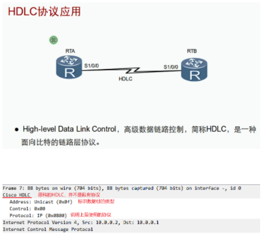
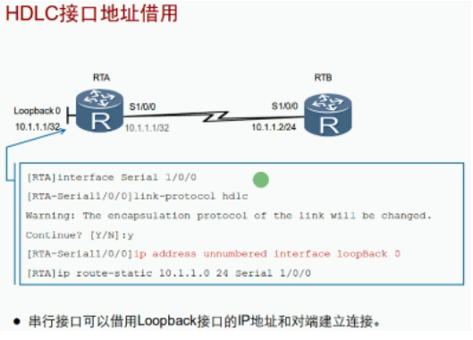
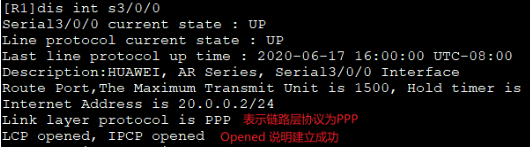

# HDLC

 

- 可以租用接口地址来节省IP地址，同时可以批量修改端口地址
# PPP

| 名称 | 认证 | 错误检测 | 错误恢复 | 支持同步或异步链路 |
| ---- | ---- | -------- | -------- | ------------------ |
| HDLC | ×    | √        | ×        | ×                  |
| PPP  | √    | √        | √        | √                  |

PPP组件

|      | 名称                                      | 作用                                         |
| ---- | ----------------------------------------- | -------------------------------------------- |
| 上层 | NCP网络层控制协议Network Control Protocol | 用于对不同的网络层协议进行连接建立和参数协商 |
| 下层 | LCP链路控制协议Link Control Protocol      | 用于建立、拆除和监控PPP数据链路以及认证      |

 

PPP认证模式：PAP和CHAP
<table>
	<tr>
		<th>模式
		<th>备注
	</tr>
    <tr>
    	<td rowspan="3">PAP（发明文密码）</td>
        <td>Password authentication protocol，密码认证协议 ，以明文方式直接放送密码，二次握手机制，发起方为被认证方  缺点：以明文的形式发送密码不安全 因为发送方为被任正非所以可以无限次的尝试（暴力破解） 只在链路建立的阶段认证，一旦成功建立后将不在认证</td>
    </tr>
	<tr>
		<td></image></td>
	</tr>
	<tr>
		<td></image></td>
	</tr>
    <tr>
        <td rowspan="3">CHAP（发暗号）</td>
        <td>Challenge Handshake Authentication Protocol，挑战/质询握手认证议，以MD5来隐藏密码，三次握手机制，发起方为认证方，有效避免了暴力破解，在链路建立后具有再次认证检测机制，目前使用的广泛</td>
    </tr>
	<tr>
		<td></image></td>
	</tr>
	<tr>
		<td></image></td>
	</tr>
</table>

PPP认证配置：

| 命令                                                         | 备注                                |
| ------------------------------------------------------------ | ----------------------------------- |
| aaa      local-user huawei password cipher 123.com      local-user huawei service-type ppp | 配置PPP，设置用户名、密码和服务类型 |
| ppp authentication-mode PAP 或ppp authentication-mode CHAP   | 开启PAP或CHAP认证（认证方配的）     |
| ppp pap local-user huawei password cipher 123.com            | 配置PAP认证（被认证方配的）         |
| ppp chap user huawei ppp chap password cipher 123.com    | 配置CHAP认证（被认证方配的）        |

注：

只配置一方的用户名和密码，另一方开启认证的，这种为单向认证。

=======

HDLC

 

- 可以租用接口地址来节省IP地址，同时可以批量修改端口地址

PPP

 

| 名称 | 认证 | 错误检测 | 错误恢复 | 支持同步或异步链路 |
| ---- | ---- | -------- | -------- | ------------------ |
| HDLC | ×    | √        | ×        | ×                  |
| PPP  | √    | √        | √        | √                  |

PPP组件

|      | 名称                                      | 作用                                         |
| ---- | ----------------------------------------- | -------------------------------------------- |
| 上层 | NCP网络层控制协议Network Control Protocol | 用于对不同的网络层协议进行连接建立和参数协商 |
| 下层 | LCP链路控制协议Link Control Protocol      | 用于建立、拆除和监控PPP数据链路以及认证      |

 

 

 

PPP认证模式：PAP和CHAP
<table>
	<tr>
		<th>模式
		<th>备注
	</tr>
    <tr>
    	<td rowspan="3">PAP（发明文密码）</td>
        <td>Password authentication protocol，密码认证协议 ，以明文方式直接放送密码，二次握手机制，发起方为被认证方  缺点：以明文的形式发送密码不安全 因为发送方为被任正非所以可以无限次的尝试（暴力破解） 只在链路建立的阶段认证，一旦成功建立后将不在认证</td>
    </tr>
	<tr>
		<td></image></td>
	</tr>
	<tr>
		<td></image></td>
	</tr>
    <tr>
        <td rowspan="3">CHAP（发暗号）</td>
        <td>Challenge Handshake Authentication Protocol，挑战/质询握手认证议，以MD5来隐藏密码，三次握手机制，发起方为认证方，有效避免了暴力破解，在链路建立后具有再次认证检测机制，目前使用的广泛</td>
    </tr>
	<tr>
		<td></image></td>
	</tr>
	<tr>
		<td></image></td>
	</tr>
</table>

PPP认证配置：

| 命令                                                         | 备注                                |
| ------------------------------------------------------------ | ----------------------------------- |
| aaa      local-user huawei password cipher 123.com      local-user huawei service-type ppp | 配置PPP，设置用户名、密码和服务类型 |
| ppp authentication-mode PAP 或ppp authentication-mode CHAP   | 开启PAP或CHAP认证（认证方配的）     |
| ppp pap local-user huawei password cipher 123.com            | 配置PAP认证（被认证方配的）         |
| ppp chap user huawei ppp chap password cipher 123.com    | 配置CHAP认证（被认证方配的）        |

注：
- 只配置一方的用户名和密码，另一方开启认证的，这种为单向认证。
- 两边都配置用户名和密码，同时开启认证模式，互相发送认证信息，这种为双向认证。
