# 交换基础

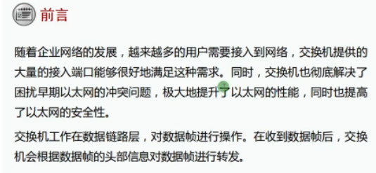

网络分层设计：
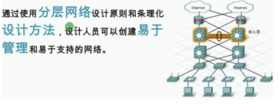
- 易于理解、学习、排错

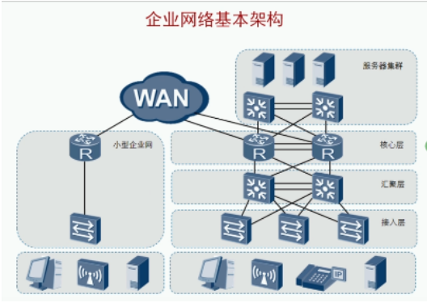

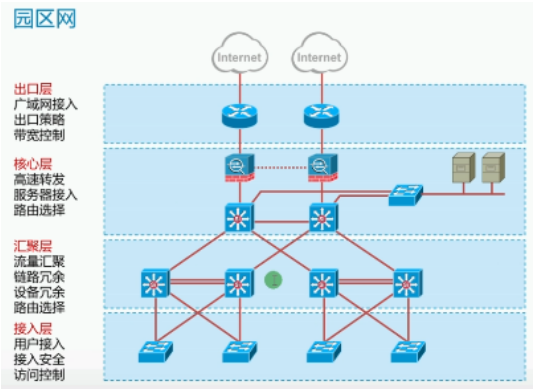

| 层次                     | 备注                                |
| ------------------------ | ----------------------------------- |
| 接入层Access layer       | 用户接入 接入安全 访问控制          |
| 汇聚层Distribution layer | 流量汇聚 链路冗余 设备冗余 路由选择 |
| 核心层Core layer         | 高速转发 服务器接入 路由选择        |
| 出口层Speak layer        | 广域网接入 出口策略 带宽控制        |

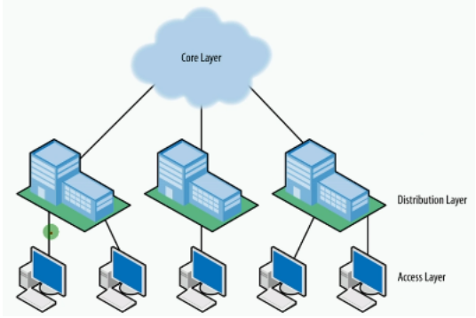

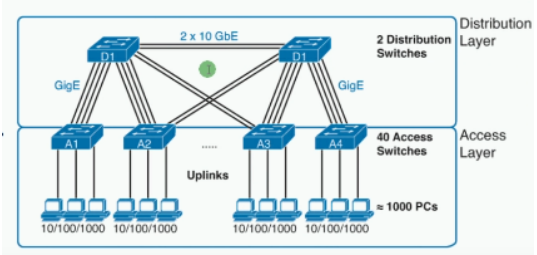

对层次的带宽要求几何增长
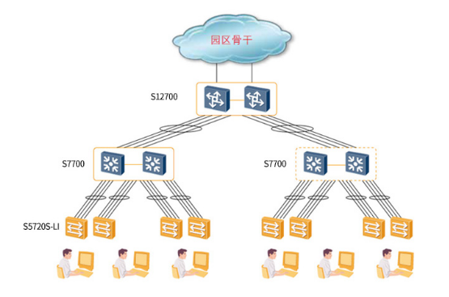

对层次的设备性能要求集合增长

交换机的主要功能：
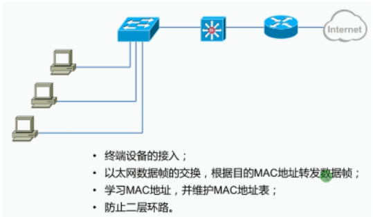

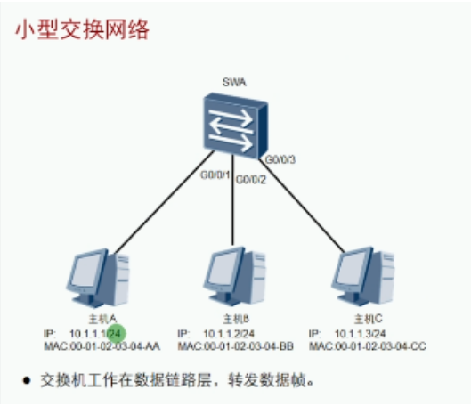

交换机根据MAC地址来转发数据帧

交换机的工作原理：根据MAC地址表中的MAC地址表项，做出智能转发
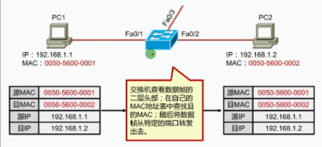

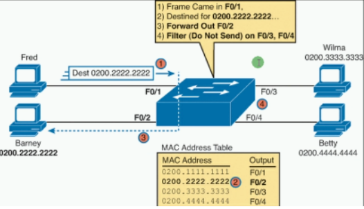

| 原理        | 备注                                                         |
| ----------- | ------------------------------------------------------------ |
| 学习 Learn  | 从一个接口收到数据帧时，把数据帧的源MAC地址和该接口进行绑定，存放MAC地址表 |
| 泛洪Flood   | 从一个接口收到广播帧、组播帧、未知单播帧，把该帧从其他所有接口转发出去（除接收口） |
| 转发Forward | 从一个接口收到已知单播帧，立即从相应的接口转发出去（除目标地址是自己） |
| 更新Update  | 交换机地址表中的表项默认的保存300秒交换机重启会清空所有接口学习到的记录接口关闭后会清空该接口学习到的记录一个源MAC地址出现在别的接口上，会删除老的记录，添加新的记录 |
| 注：        | 对应一台交换机来说：一个MAC地址只能关联一个接口上一个接口可以存在多个MAC地址 |

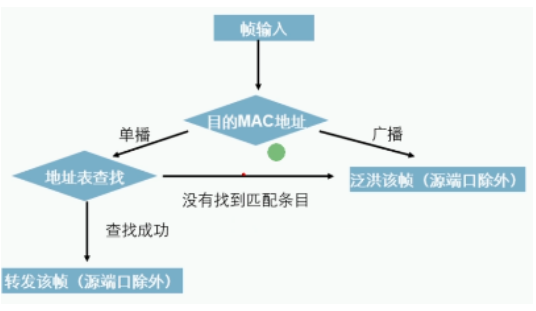

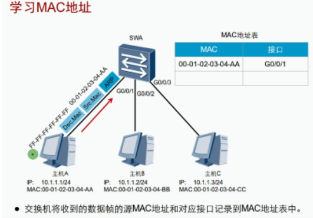

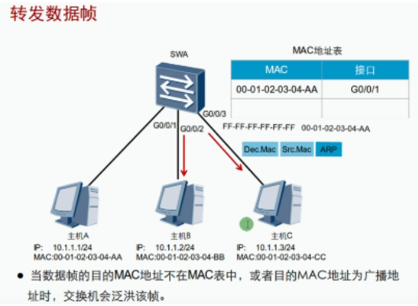

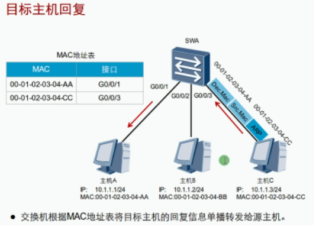

以太网接口工作模式：

| 术语   | 备注                                              |
| ------ | ------------------------------------------------- |
| 半双工 | half-duplex通信双方不能同时发送接收数据           |
| 全双工 | full-duplex通信双方可以同时发送接收数据           |
| 速率   | Speed接口两端连接时进行协商，协商失败无法正常通信 |

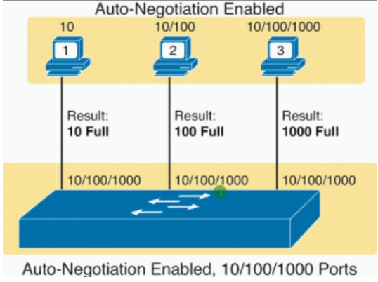

可以设置两端的通信模式默认是自动（选取两端设备的最低值）

网络速度无其他因素影响，但网速很慢可能是半双工模式

电脑设置通信模式：
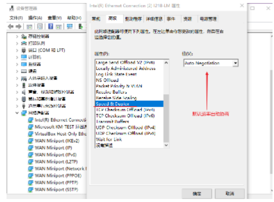

交换机设置通信模式：

| 术语                  | 备注                 |
| --------------------- | -------------------- |
| undo negotiation auto | 取消自动协商         |
| speed 100             | 设置速率             |
| duplex full           | 设置通信模式为全双工 |
| duplex half           | 设置通信模式为半双工 |

