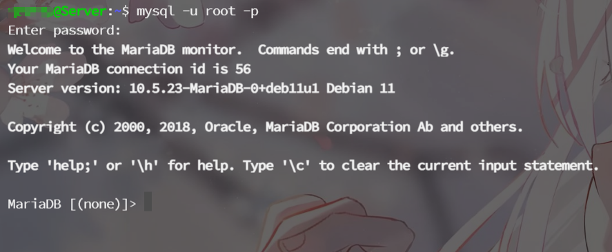

# 前言

为了增加服务器数据库安全性，大多数人都会限定该用户操作指定的数据库，而无法影响到其他的数据库，从而提高了数据操作的安全性。


# 1. 登录数据库

```shell
mysql -u root -p
```

输入密码登录




# 2. 创建用户

```shell
create user`user`@`localhost` identified by'password';
```

这样就创建了一个用户名为user，密码为password的MySQL用户。

@后面的参数是指可以登录的IP地址


```shell
'用户名'@'IP地址'        //用户只能该IP下才能访问
'用户名'@'192.168.1.%'   //用户只能在该IP段下才能访问(通配符%表示任意)
'用户名'@'%'             //用户可以再任意IP下访问(默认IP地址为%)
'用户名'@'localhost'     //用户只能在本地主机（安装MySQL服务器的主机）下访问
```


# 3. 授予权限

用户创建完成后，还需要进行权限赋予，否则该用户会没有权限操作数据库表。

`show grants for '用户'@'IP地址';` 查看用户拥有的权限

```shell
grant all privileges on 数据库名.* to '用户'@'IP地址' with grant option;	//将数据库的所有权限赋予该用户
```

`with grant option` 参数表示该用户可以将自己拥有的权限授权给别人，**如果不想这个用户有这个grant的权限，可以不加这句**


# 4. 常用命令


```shell
show databases;		                                    // 查看所有数据库
show grants for '用户名'@'IP地址';	                    // 查看用户拥有的权限
drop user '用户名'@'IP地址';		                        // 删除用户
rename user '用户名'@'IP地址' to '新用户名'@'IP地址';		// 修改用户的用户名和可登录IP
set password for '用户名'@'IP地址' = password('新密码');  // 修改用户密码
set password=password('新密码');		                 // 修改当前登录用户的密码
revoke 权限 on 数据库.表 from '用户'@'IP地址';		    // 删除用户某一权限
```


# 5. 常用权限

```shell
all privileges          除grant外的所有权限
select                  仅查权限
select,insert           查和插入权限
usage                   无访问权限
alter                   使用alter table
create                  使用create table
create routine          使用create procedure
create temporary tables 使用create temporary tables
create user             使用create user、drop user、rename user和revoke  all privileges
create view             使用create view
delete                  使用delete
drop                    使用drop table
execute                 使用call和存储过程
file                    使用select into outfile 和 load data infile
grant option            使用grant 和 revoke
index                   使用index
insert                  使用insert
lock tables             使用lock table
process                 使用show full processlist
select                  使用select
show databases          使用show databases
show view               使用show view
update                  使用update
reload                  使用flush
shutdown                使用mysqladmin shutdown(关闭MySQL)
replication client      服务器位置的访问
replication slave       由复制从属使用
 
// 数据库名.*       数据库中的所有表
	数据库名.表          指定数据库中的某张表
	数据库名.存储过程    指定数据库中的存储过程
	*.*                 所有数据库中的所有表

```

FLUSH PRIVILEGES;

flush privileges;

