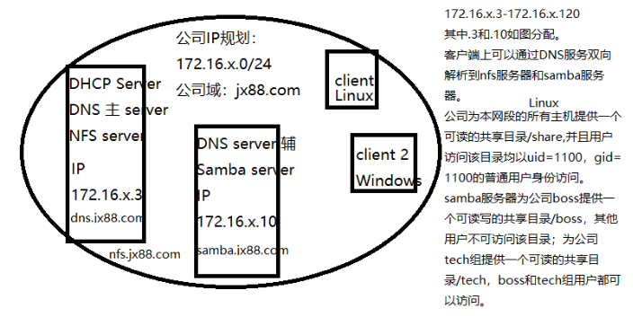

## 1、RedHat-01配置（172.16.20.3）

#### 1）DHCP Server（172.16.20.3）

1. 安装dhcp服务

    ```shell
    [aaa@c1 ~]$ sudo yum install dhcp-server -y
    ```

2. 配置服务器静态IP

    ```shell
    [aaa@c1 ~]$ sudo vim /etc/sysconfig/network-scripts/ifcfg-ens160
    BROWSER_ONLY=no
    BOOTPROTO=static
    DEFROUTE=yes
    IPV4_FAILURE_FATAL=no
    IPV6INIT=yes
    IPV6_AUTOCONF=yes
    IPV6_DEFROUTE=yes
    IPV6_FAILURE_FATAL=no
    IPV6_ADDR_GEN_MODE=stable-privacy
    NAME=ens160
    UUID=51c352cf-52eb-40df-9cdd-2bbb6d3caea2
    DEVICE=ens160
    ONBOOT=yes
    IPV6_PRIVACY=no
    PEERDNS=no
    IPADDR=172.16.20.3
    NETMASK=255.255.255.0
    GATEWAY=172.16.20.1
    ```

3. 配置dhcp服务

    ```shell
    [aaa@c1 ~]$ sudo cp /usr/share/doc/dhcp*/dhcpd.conf.example /etc/dhcp/dhcpd.conf
    [aaa@c1 ~]$ sudo vim /etc/dhcp/dhcpd.conf
    # 删除多余配置，添加以下内容：
    
    option domain-name "dns.ix88.com";
    option domain-name-servers 172.16.20.3;
    
    default-lease-time 600;
    max-lease-time 7200;
    
    log-facility local7;
    
    subnet 172.16.20.0 netmask 255.255.255.0 {
      range 172.16.20.3 172.16.20.120;
      option domain-name-servers 172.16.20.3;
      option domain-name "dns.ix88.com";
      option routers 172.16.20.1;
      default-lease-time 600;
      max-lease-time 7200;
    }
    
    # 查看samba服务器的ens-160网卡，得到网卡地址进行地址绑定
    host samba.ix88.com {
      hardware ethernet 00:0c:29:50:e8:3d;
      fixed-address 172.16.20.10;
    }
    
    ```

4. 重启dhcp服务

    ```shell
    [aaa@c1 ~]$ sudo systemctl restart dhcpd
    ```

#### 2）主DNS Server（dns.ix88.com）

1. 安装bind

    ```shell
    [aaa@c1 ~]$ sudo yum install bind* -y
    ```

2. 修改`sudo vim /etc/named.conf`改两个`any`

3. 修改`sudo vim /etc/named.rfc1912.zones`

    ```shell
    # 文件末尾添加以下语句：
    zone "ix88.com" IN {
            type master;
            file "ix88.com.zone";
            allow-update { none; };
    };
    
    zone "20.16.172.in-addr.arpa" IN {
            type master;
            file "0.20.16.172.arpa";
            allow-update { none; };
    };
    ```

4. 编辑正反向解析区域

    ```shell
    # 复制模版文件
    [aaa@c1 ~]$ sudo cp -a /var/named/named.localhost /var/named/ix88.com.zone
    [aaa@c1 ~]$ sudo cp -a /var/named/named.loopback /var/named/0.20.16.172.arpa
    
    # 编辑ix88.com.zone
    [aaa@c1 ~]$ sudo vim /var/named/ix88.com.zone
    
    $TTL 1D
    @       IN SOA  @ rname.invalid. (
                                            0       ; serial
                                            1D      ; refresh
                                            1H      ; retry
                                            1W      ; expire
                                            3H )    ; minimum
            NS      dns.ix88.com.
            A       127.0.0.1
            AAAA    ::1
    dns     A       172.16.20.3
    nfs     CNAME   dns
    samba   A       172.16.20.1
    
    # 编辑0.20.16.172.arpa
    [aaa@c1 ~]$ sudo vim /var/named/0.20.16.172.arpa
    
    $TTL 1D
    @       IN SOA  @ rname.invalid. (
                                            0       ; serial
                                            1D      ; refresh
                                            1H      ; retry
                                            1W      ; expire
                                            3H )    ; minimum
            NS      dns.ix88.com.
            A       127.0.0.1
            AAAA    ::1
    3       PTR     dns.ix88.com.
    3       PTR     nfs.ix88.com.
    10      PTR     samba.ix88.com.
    
    ```

5. 重启named服务并放行dns服务

    ```shell
    [aaa@c1 ~]$ sudo systemctl restart named
    [aaa@c1 ~]$ sudo firewall-cmd --permanent --add-service=dns
    [aaa@c1 ~]$ sudo firewall-cmd --reload
    ```

6. 客户端验证


#### 3）NFS Server（nfs.ix88.com）

1. 安装NFS服务并放行防火墙

    ```shell
    [aaa@c1 ~]$ sudo yum install rpcbind nfs-utils -y
    [aaa@c1 ~]$ sudo firewall-cmd --permanent --add-service=nfs
    [aaa@c1 ~]$ sudo firewall-cmd --reload
    ```

2. 创建共享目录`/share`，并添加测试文件

    ```shell
    [aaa@c1 ~]$ sudo mkdir /share
    # 切换为root权限
    [root@c1 ~]$ echo "This is test file" > /share/ReadOnly
    [aaa@c1 ~]$ sudo chmod 777 -R /share
    ```

3. 修改配置文件添加一下内容

    ```shell
    [aaa@c1 ~]$ sudo vim /etc/exports
    
    /share  172.16.20.0/24(ro,all_squash,anonuid=1100,anongid=1100)
    
    # 重启NFS服务
    [aaa@c1 ~]$ sudo systemctl restart nfs-server.service
    ```

4. 客户端验证

    ```shell
    [aaa@c2 ~]$ sudo mkdir /mnt/share
    [aaa@c2 ~]$ sudo mount -t nfs 172.16.20.3:/share /mnt/share
    
    # 验证只读权限
    [aaa@c2 ~]$ echo "Write Data" >> /mnt/share/ReadOnly 
    -bash: /mnt/share/ReadOnly: 只读文件系统
    ```


## 2、RedHat-02配置（172.16.20.10）

#### 1）辅助DNS Server

1. 安装bind并放行防火墙

    ```shell
    [aaa@c2 ~]$ sudo yum install bind* -y
    [aaa@c2 ~]$ sudo firewall-cmd --permanent --add-service=nfs
    [aaa@c2 ~]$ sudo firewall-cmd --reload
    ```

2. 修改`sudo vim /etc/named.conf`改两个`any`

3. 修改`sudo vim /etc/named.rfc1912.zones`

    ```shell
    zone "ix88.com" IN {
            type slave;
            file "slaves/slave.ix88.com.zone";
            masters { 172.16.20.3; };
    };
    
    zone "20.16.172.in-addr.arpa" IN {
            type slave;
            file "slaves/slave.0.20.16.172.arpa";
            masters { 172.16.20.3; };
    };
    ```

4. 客户端`nslookup`验证


#### 2）Samba Server（samba.ix88.com）

1. 安装`samba`并放行防火墙

    ```shell
    [aaa@c2 ~]$ sudo yum install samba -y
    [aaa@c2 ~]$ sudo firewall-cmd --permanent --add-service=samba
    [aaa@c2 ~]$ sudo firewall-cmd --reload
    ```

2. 创建共享目录

    ```shell
    [aaa@c2 ~]$ sudo mkdir /boos
    [aaa@c2 ~]$ sudo mkdir /tech
    ```

3. 创建用户和组设置密码并绑定共享目录

    ```shell
    [aaa@c2 ~]$ sudo groupadd boos
    [aaa@c2 ~]$ sudo groupadd tech
    [aaa@c2 ~]$ sudo useradd boos -g boos -G tech
    [aaa@c2 ~]$ sudo useradd tech -g tech
    [aaa@c2 ~]$ sudo passwd boos
    [aaa@c2 ~]$ sudo passwd tech
    
    [aaa@c2 ~]$ sudo chown -R boos.boos /boos
    [aaa@c2 ~]$ sudo chown -R tech.tech /tech
    ```

4. 设置samba用户

    ```shell
    [aaa@c2 ~]$ sudo smbpasswd -a boos
    [aaa@c2 ~]$ sudo smbpasswd -a tech
    ```

    

5. 设置文件ACL策略

    ```shell
    [aaa@c2 ~]$ sudo setfacl -m g:boos:rw- /boos
    [aaa@c2 ~]$ sudo setfacl -m g:boos:rw- /tech
    [aaa@c2 ~]$ sudo setfacl -m g:tech:r-- /tech
    [aaa@c2 ~]$ sudo setfacl -m o::--- /boos
    [aaa@c2 ~]$ sudo setfacl -m o::--- /tech
    # 查看文件权限是否正确
    [aaa@c2 ~]$ sudo getfacl /boos
    
    [aaa@c2 ~]$ sudo getfacl /tech
    
    ```

6. 设置配置文件，添加以下内容

    ```shell
    [aaa@c2 ~]$ sudo vim /etc/samba/smb.conf
    
    [boos]
            comment = boos
            path = /boos
            public = no
            writable = yes
            browsable = yes
    
    [tech]
            comment = tech
            path = /tech
            public = no
            writable = no
            browsable = yes
    
    ```

7. 重启samba服务

    ```shell
    [aaa@c2 ~]$ sudo systemctl restart smb
    [aaa@c2 ~]$ sudo systemctl restart nmb
    ```

8. 客户端验证

    ```shell
    # windows
    win + R
    \\samba.ix88.com
    
    # Linux
    [aaa@c1 ~]$ sudo yum install samba-client -y
    [aaa@c1 ~]$ sudo smbclient //172.16.20.10/boos -U boos	# 可读可写
    [aaa@c1 ~]$ sudo smbclient //172.16.20.10/boos -U tech	# 不可读
    [aaa@c1 ~]$ sudo smbclient //172.16.20.10/tech -U boos	# 可读
    [aaa@c1 ~]$ sudo smbclient //172.16.20.10/tech -U tech	# 可读
    ```

    


