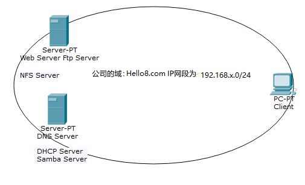

## 1、RedHat-01配置（192.168.20.5）

#### 0）安装相关服务并放行防火墙

```shell
[aaa@c1 ~]$ sudo yum install dhcp-server bind* samba -y
[aaa@c1 ~]$ sudo firewall-cmd --permanent --add-service=samba --add-service=dns
[aaa@c1 ~]$ sudo firewall-cmd --reload
[aaa@c1 ~]$ sudo firewall-cmd --list-all
```


#### 1）DHCP Server（192.168.20.5）

1. 配置服务器静态IP

    ```shell
    [aaa@c1 ~]$ sudo vim /etc/sysconfig/network-scripts/ifcfg-enp0s3
    BROWSER_ONLY=no
    BOOTPROTO=static
    DEFROUTE=yes
    IPV4_FAILURE_FATAL=no
    IPV6INIT=yes
    IPV6_AUTOCONF=yes
    IPV6_DEFROUTE=yes
    IPV6_FAILURE_FATAL=no
    IPV6_ADDR_GEN_MODE=stable-privacy
    NAME=enp0s3
    UUID=51c352cf-52eb-40df-9cdd-2bbb6d3caea2
    DEVICE=enp0s3
    ONBOOT=yes
    IPV6_PRIVACY=no
    PEERDNS=no
    IPADDR=192.168.20.5
    NETMASK=255.255.255.0
    GATEWAY=192.168.20.1
    ```

2. 配置dhcp服务

    ```shell
    [aaa@c1 ~]$ sudo cp /usr/share/doc/dhcp*/dhcpd.conf.example /etc/dhcp/dhcpd.conf
    [aaa@c1 ~]$ sudo vim /etc/dhcp/dhcpd.conf
    # 删除多余配置，添加以下内容：
    
    option domain-name "dns.Hello8.com";
    option domain-name-servers 192.168.20.5;
    
    default-lease-time 600;
    max-lease-time 7200;
    
    log-facility local7;
    
    subnet 192.168.20.0 netmask 255.255.255.0 {
      range 192.168.20.10 192.168.20.100;
      option domain-name-servers 192.168.20.5;
      option domain-name "dns.Hello8.com";
      option routers 192.168.20.1;
      default-lease-time 600;
      max-lease-time 7200;
    }
    
    # 查看web服务器的enp0s3网卡，得到网卡地址进行地址绑定
    host www.Hello8.com {
      hardware ethernet 08:00:27:a2:73:3b;
      fixed-address 192.168.20.10;
    }
    
    ```

3. 重启dhcp服务

    ```shell
    [aaa@c1 ~]$ sudo systemctl restart dhcpd
    ```

#### 2）DNS Server（dns.Hello8.com）

1. 修改`sudo vim /etc/named.conf`改两个`any`

2. 修改`sudo vim /etc/named.rfc1912.zones`

    ```shell
    # 文件末尾添加以下语句：
    zone "Hello8.com" IN {
            type master;
            file "Hello8.com.zone";
            allow-update { none; };
    };
    
    zone "20.168.192.in-addr.arpa" IN {
            type master;
            file "0.20.168.192.arpa";
            allow-update { none; };
    };
    ```

3. 编辑正反向解析区域

    ```shell
    # 复制模版文件
    [aaa@c1 ~]$ sudo cp -a /var/named/named.localhost /var/named/Hello8.com.zone
    [aaa@c1 ~]$ sudo cp -a /var/named/named.loopback /var/named/0.20.168.192.arpa
    
    # 编辑ix88.com.zone
    [aaa@c1 ~]$ sudo vim /var/named/Hello8.com.zone
    
    $TTL 1D
    @       IN SOA  @ rname.invalid. (
                                            0       ; serial
                                            1D      ; refresh
                                            1H      ; retry
                                            1W      ; expire
                                            3H )    ; minimum
            NS      dns.Hello8.com.
            A       127.0.0.1
            AAAA    ::1
    dns     A       192.168.20.5
    dhcp    CNAME   dns
    samba   CNAME   dns
    www     A       192.168.20.10
    nfs     CNAME   www
    ftp     CNAME   www
    
    # 编辑0.20.16.172.arpa
    [aaa@c1 ~]$ sudo vim /var/named/0.20.168.192.arpa
    
    $TTL 1D
    @       IN SOA  @ rname.invalid. (
                                            0       ; serial
                                            1D      ; refresh
                                            1H      ; retry
                                            1W      ; expire
                                            3H )    ; minimum
            NS      dns.Hello8.com.
            A       127.0.0.1
            AAAA    ::1
    5       PTR     dns.Hello8.com.
    5       PTR     dhcp.Hello8.com.
    5       PTR     samba.Hello8.com.
    10      PTR     nfs.Hello8.com.
    10      PTR     ftp.Hello8.com.
    10      PTR     www.Hello8.com.
    
    
    ```

4. 客户端验证


#### 3）Samba Server（samba.Hello8.com）

1. 创建共享目录

   ```shell
   [aaa@c2 ~]$ sudo mkdir /boos
   [aaa@c2 ~]$ sudo mkdir /sales
   ```

2. 创建用户和组设置密码并绑定共享目录

   ```shell
   [aaa@c2 ~]$ sudo groupadd boos
   [aaa@c2 ~]$ sudo groupadd sales
   [aaa@c2 ~]$ sudo useradd boos -g boos -G sales
   [aaa@c2 ~]$ sudo useradd sales -g sales
   [aaa@c2 ~]$ sudo passwd boos
   [aaa@c2 ~]$ sudo passwd sales
   
   [aaa@c2 ~]$ sudo chown -R boos.boos /boos
   [aaa@c2 ~]$ sudo chown -R sales.sales /sales
   ```

3. 设置samba用户

   ```shell
   [aaa@c2 ~]$ sudo smbpasswd -a boos
   [aaa@c2 ~]$ sudo smbpasswd -a sales
   ```

   

4. 设置文件ACL策略

   ```shell
   [aaa@c2 ~]$ sudo setfacl -m g:boos:rw- /boos
   [aaa@c2 ~]$ sudo setfacl -m g:boos:r-- /sales
   [aaa@c2 ~]$ sudo setfacl -m g:sales:r-- /sales
   [aaa@c2 ~]$ sudo setfacl -m o::--- /boos
   [aaa@c2 ~]$ sudo setfacl -m o::--- /sales
   # 查看文件权限是否正确
   [aaa@c2 ~]$ sudo getfacl /boos
   
   [aaa@c2 ~]$ sudo getfacl /sales
   
   ```

5. 设置配置文件，添加以下内容

   ```shell
   [aaa@c2 ~]$ sudo vim /etc/samba/smb.conf
   
   [boos]
           comment = boos
           path = /boos
           public = no
           writable = yes
           browsable = yes
   
   [sales]
           comment = sales
           path = /sales
           public = no
           writable = no
           browsable = yes
   
   ```

6. 重启samba服务

   ```shell
   [aaa@c2 ~]$ sudo systemctl restart smb
   [aaa@c2 ~]$ sudo systemctl restart nmb
   ```

7. 客户端验证

   ```shell
   # windows
   win + R
   \\samba.Hello8.com
   
   # Linux
   [aaa@c1 ~]$ sudo yum install samba-client -y
   [aaa@c1 ~]$ sudo smbclient //192.168.20.5/boos -U boos		# 可读可写
   [aaa@c1 ~]$ sudo smbclient //192.168.20.5/boos -U sales		# 不可访问
   [aaa@c1 ~]$ sudo smbclient //192.168.20.5/sales -U boos		# 可读
   [aaa@c1 ~]$ sudo smbclient //192.168.20.5/sales -U sales	# 可读
   ```

   

## 2、RedHat-02配置（192.168.20.10）

#### 0）安装相关服务并放行防火墙

```shell
[aaa@c1 ~]$ sudo yum install rpcbind nfs-utils vsftpd httpd -y
[aaa@c1 ~]$ sudo firewall-cmd --permanent --add-service=http --add-service=nfs --add-service=ftp
[aaa@c1 ~]$ sudo firewall-cmd --reload
[aaa@c1 ~]$ sudo firewall-cmd --list-all
```


#### 1）NFS Server（nfs.Hello8.com）

1. 创建共享目录`/public`，并添加测试文件

   ```shell
   [aaa@c1 ~]$ sudo mkdir /public
   # 切换为root权限
   [root@c1 ~]$ echo "This is test file" > /public/demo-file
   [aaa@c1 ~]$ sudo chmod 777 -R /public
   ```

2. 修改配置文件添加一下内容

   ```shell
   [aaa@c1 ~]$ sudo vim /etc/exports
   
   /public  192.168.20.0/24(rw,all_squash,anonuid=1105,anongid=1105)
   
   # 重启NFS服务
   [aaa@c1 ~]$ sudo systemctl restart nfs-server.service
   ```

3. 客户端验证

   ```shell
   [aaa@c2 ~]$ sudo mkdir /mnt/public
   [aaa@c2 ~]$ sudo mount -t nfs 192.168.20.10:/public /mnt/public
   
   # 验证读权限
   [aaa@c2 ~]$ echo "Write Data" >> /mnt/public/demo-file
   
   ```


#### 2）FTP Server（ftp.Hello8.com）

1. 备份vsftpd的配置文件
   ```shell
   [aaa@c2 ~]$ sudo cp /etc/vsftpd/vsftpd.conf /etc/vsftpd/vsftpd.con.bak
   ```

2. 创建用户和组

   ```shell
   [aaa@c2 ~]$ sudo useradd -s /sbin/nologin team1
   [aaa@c2 ~]$ sudo passwd team1
   ...
   [aaa@c2 ~]$ 
   [aaa@c2 ~]$ 
   [aaa@c2 ~]$ 
   [aaa@c2 ~]$ 
   ```

   

3. 打开配置文件

   ```shell
   [aaa@c2 ~]$ sudo vim /etc/vsftpd/vsftpd.conf
   
   # 修改以下内容
   anonymous_enable=NO
   local_enable=YES
   local_root=/var/www
   chroot_list_enable=YES
   chroot_list_file=/etc/vsftpd/chroot_list
   allow_writeable_chroot=YES
   
   # 添加放行用户
   [aaa@c2 ~]$ sudo vim /etc/vsftpd/chroot_list
   
   team1
   
   # 修改本地权限
   [aaa@c2 ~]$ sudo chmod -R o+w /var/www/
   
   # 修改pam配置文件
   [aaa@c2 ~]$ sudo vim /etc/pam.d/vsftpd
   注释auth   required pam_shells.so
   
   ```

4. 重启vsftpd 服务

   ```shell
   [aaa@c2 ~]$ sudo systemctl restart vsftpd
   ```

5. 验证


#### 3）Web Server（www.Hello8.com）

1. 添加一个ip地址

   ```shell
   [aaa@c2 ~]$ sudo vim /etc/sysconfig/network-scripts/ifcfg-enp0s3:0
   
   DEVICE=enp0s3:0
   TYPE=Ethernet
   BOOTPROTO=static
   IPADDR=192.168.20.11
   NETMASK=255.255.255.0
   GATEWAY=192.168.20.1
   ONBOOT=yes
   
   [aaa@c2 ~]$ sudo ifup enp0s3
   ```

2. 添加用户并生成密码文件

   ```shell
   [aaa@c2 ~]$ sudo htpasswd -cs /etc/httpd/conf.d/.htpasswd huangwenlong
   ```

3. 编辑用户验证配置和两个虚拟主机

   ```shell
   [aaa@c2 ~]$ sudo vim /etc/httpd/conf.d/userdir.conf
   
   <Directory /var/www/web2>
       Options Indexes FollowSymLinks
       allowoverride authconfig
       AllowOverride None
       AuthType Basic
       AuthName "huangwenlong"
       AuthUserFile /etc/httpd/conf.d/.htpasswd
       Require user huangwenlong
   </Directory>
   
   [aaa@c2 ~]$ sudo vim /etc/httpd/conf.d/VirHost.conf
   
   <VirtualHost 192.168.20.10:80>
       DocumentRoot "/var/www/web1"
       ErrorLog logs/10-error_log
   </VirtualHost>
   
   <VirtualHost 192.168.20.11:80>
       DocumentRoot "/var/www/web2"
       ErrorLog logs/11-error_log
   </VirtualHost>
   
   ```

4. 为个人用户创建站点

   ```shell
   [aaa@c2 ~]$ sudo useradd huangwenlong
   [aaa@c2 ~]$ sudo passwd huangwenlong
   [aaa@c2 ~]$ sudo vim /etc/httpd/conf.d/userdir.conf
   
   <IfModule mod_userdir.c>
       #
       # UserDir is disabled by default since it can confirm the presence
       # of a username on the system (depending on home directory
       # permissions).
       #
       #UserDir disabled
   
       #
       # To enable requests to /~user/ to serve the user's public_html
       # directory, remove the "UserDir disabled" line above, and uncomment
       # the following line instead:
       # 
       UserDir public_html
   </IfModule>
   
   [aaa@c2 ~]$ sudo mkdir /home/huangwenlong/public_html
   [aaa@c2 ~]$ sudo echo "This is my web site huangwenlongggggg" > /home/huangwenlong/public_html/index.html
   [aaa@c2 ~]$ sudo chown -R huangwenlong.huangwenlong /home/huangwenlong
   [aaa@c2 ~]$ sudo chmod 755 -R /home/huangwenlong
   ```

5. 测试

   ```shell
   [aaa@c2 ~]$ mkdir /var/www/web1
   [aaa@c2 ~]$ mkdir /var/www/web2
   [aaa@c2 ~]$ echo "This is web111111" > /var/www/web1/index.html
   [aaa@c2 ~]$ echo "This is web222222" > /var/www/web2/index.html
   ```

   


