IP地址：IP Address 在网络中，通信节点都需要有一个IP地址
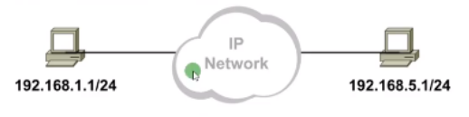

- 以点分十进制表示，有32位二进制构成（大小约43亿）
- 分为两大部分：网络位和主机位
- 网络位，代表IP地址所属的网段
- 主机位，代表网点上的某个节点

由子网掩码决定 “分界点”
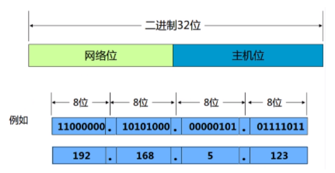

**熟记**：
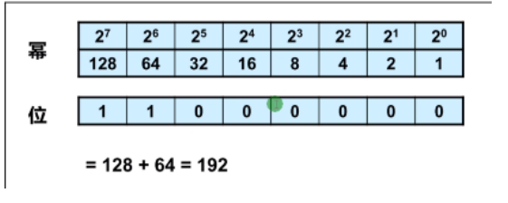

IP地址分类：IP地址分为A,B,C,D,E五类地址
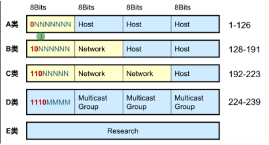

能够被主机使用的地址：A,B,C “单播地址”
只能用作目的的地址：D “组播地址”

- A类：0~126
- B类：128~191
- C类：192~223
- D类：224~239
- E类：240~255

特殊用途的地址：
- 0.0.0.0 任意地址 用于配置默认路由
- 127.0.0.0 环回地址 用于测试本地的TCP/IP协议栈是否正常
- 169.254.0.0 微软分配的地址 用于在DHCP地址获取失败后使用的地址
- 255.255.255.255 广播地址 用于本网络所有节点

在IP地址中定义了两种地址：公网地址和私网地址
- 公有地址：用于Internet，向ISP付费申请的地址，全球唯一
- 私网地址：仅用于企业网络内部，不能用于Internet，免费使用，可以重复

公网地址直接访问Internet，私网地址不能直接访问Internet。
私网地址访问Internet，需要NAT地址转换协议，将私网地址转换成公网地址

| 私网地址       | 范围                          |
| -------------- | ----------------------------- |
| 10.0.0.0/8     | 10.0.0.0~10.255.255.255       |
| 172.16.0.0/16  | 172.16.255.255~172.31.255.255 |
| 192.168.0.0/24 | 192.168.0.0~192.168.255.255   |

子网掩码：subnet mask
- 用于区分网络地址和主机地址
- 1表示网络位，0表示主机位（连续）
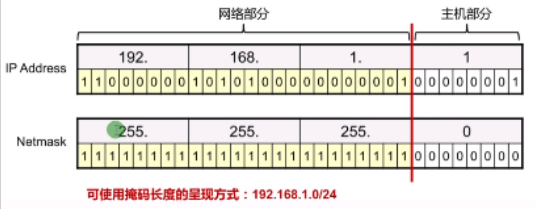

地址的默认子网掩码：

| A类 /8    255.0.0.0     |
| ----------------------- |
| B类/16   255.255.0.0    |
| C类 /24   255.255.255.0 |

每个网段上都有两个特殊地址（最大和最小）是不能够使用的：网络地址和广播地址
网络地址和广播地址：

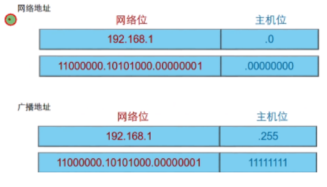

 

网络地址、主机地址、广播地址：

| 网络地址 | 主机位全0代表一个网段（头）             |
| -------- | --------------------------------------- |
| 主机地址 | 主机位不能全0或1代表网段内的一个节点    |
| 广播地址 | 主机位全1代表一个网段内的所有节点（尾） |

可用主机地址：掐头去尾 （减去网络和广播）
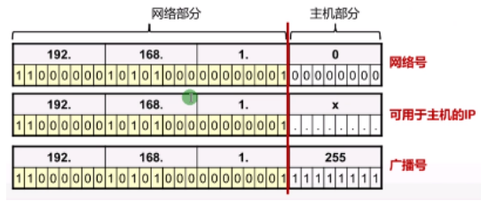

A,B,C类地址默认掩码
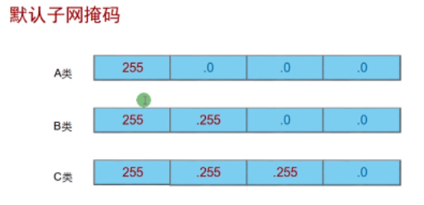

有类IP地址规划的缺陷：使用默认掩码的问题：地址范围过大或过小，导致IP地址的浪费
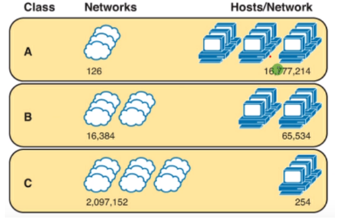
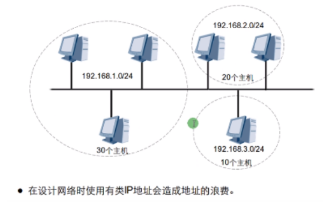

 

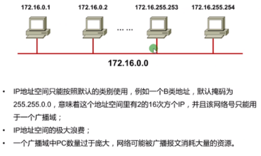

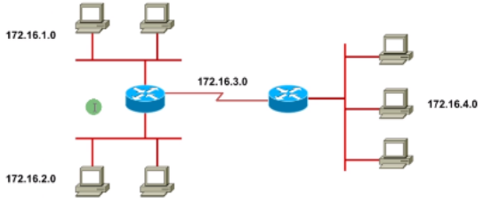

子网划分：
- 满足不同网络对IP地址的需求
- 实现网络的层次化
- 节省IP地址
- 默认子网掩码可以进一步划分，称为可边长子网掩码“VLSM”
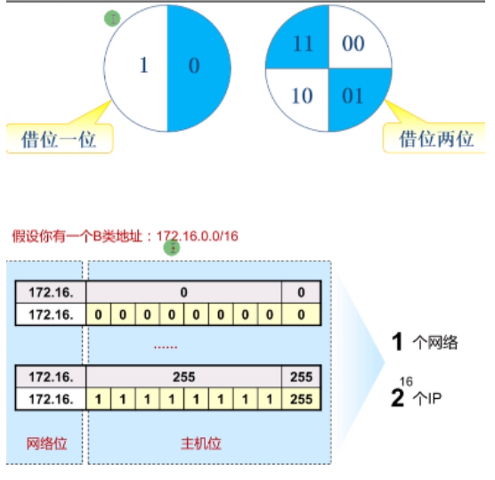

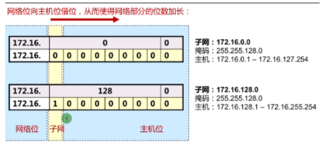

向主机位借1位，可以划分出两个网络

公式：
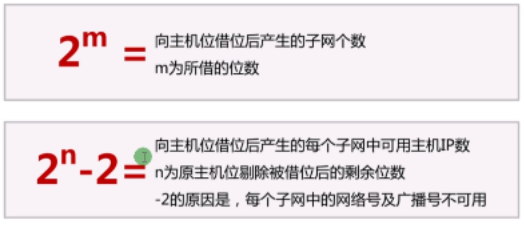
