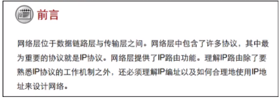
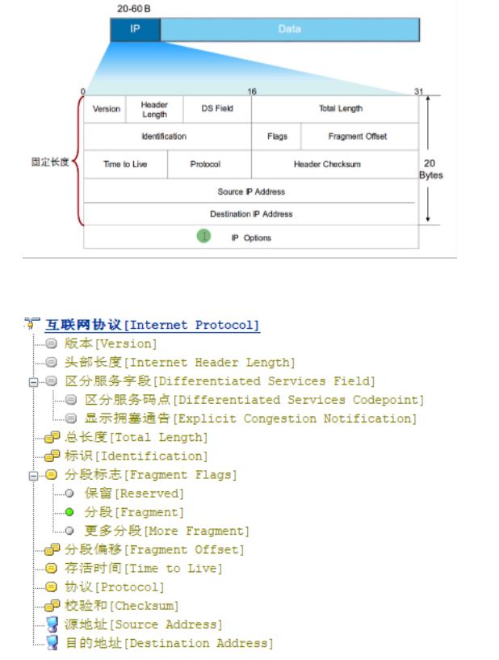
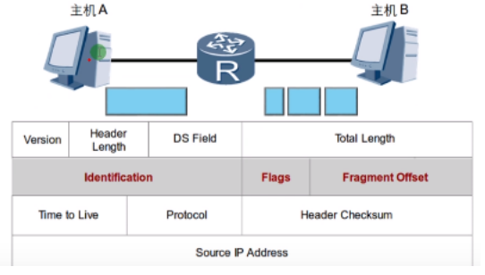
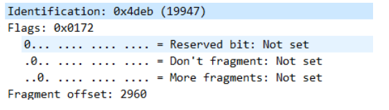
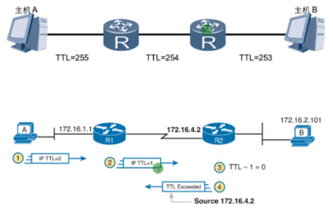
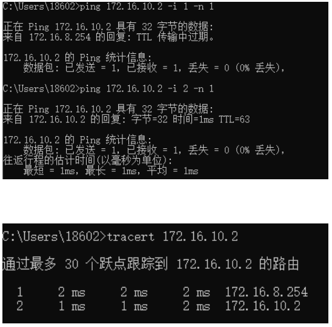
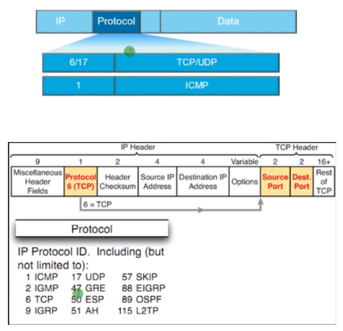

IP：Internet protocol 因特网协议：网络层占主导地址协议：IP

IP报文结构：

- 版本version：标明IP报文的版本（ v4 或 v6）
- 头部长度header length：头部长度（最小为20B，最大为60B）
- 总长度total length：头部长度和数据长度

分片：当数据包的大小超过数据链路层的MTU就需要分成多份数据包传输

 

分片之后重组依靠：
* 标志 identification
* 标识符 flags 
* 片偏移 fragment offset

**标志**：用来标识同一个数据包
**标识符**：
- 保留 ：未使用
- 分段：置位表示不能分片 （遇到超过MTU的直接丢弃）
- 更多分段：置位标识还有分片（未置位表示这是最后一个分片）

**片偏移**：说明该数据包在重组后的位置

TTL：time to live 生存时间 （生命值）
- 防止数据包在网络中无休止的传递（防环）
- 每经过一次路由（路由转发）TTL值就会减1
- 当TTL值=0，丢弃数据包，并告诉源地址

利用TTL特性，可以实现路由跟踪技术，排错的重要方法之一

相关命令：ping -I 或 tracert

tracert会一次发送3个igmp echo request报文

Protocol 协议：用来标识上层使用的协议

**熟悉的协议号**

| **协议号**                    |
| ----------------------------- |
| 1.ICMP    因特网控制报文协议  |
| 2.IGMP    因特网组报文协议    |
| 6.TCP      传输控制协议       |
| 17.UDP    用户数据报协议      |
| 41.IPV6     因特网v6          |
| 47.GRE     通用路由封装协议   |
| 89.OSPF    开放式最短路径优先 |
| 103.PIM    协议无关报文       |
| 112.VRRP   虚拟路由冗余协议   |

