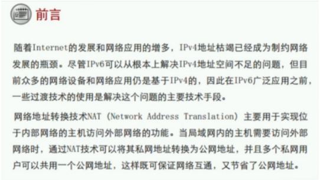
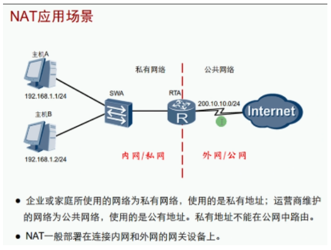
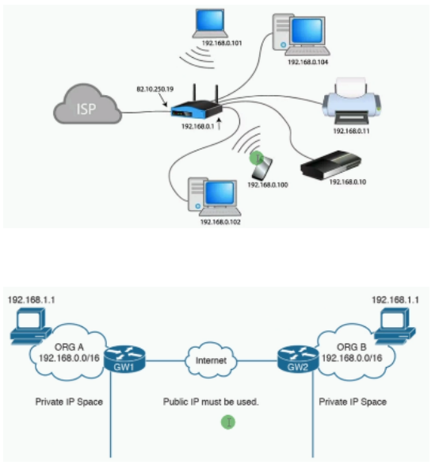
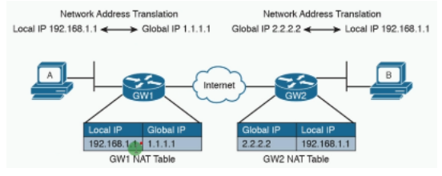
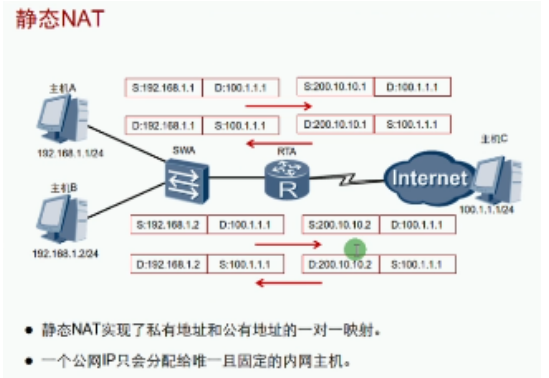
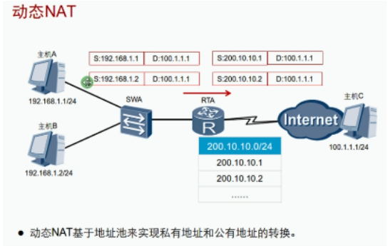
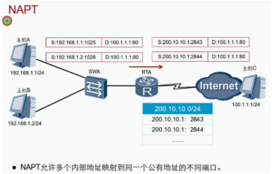
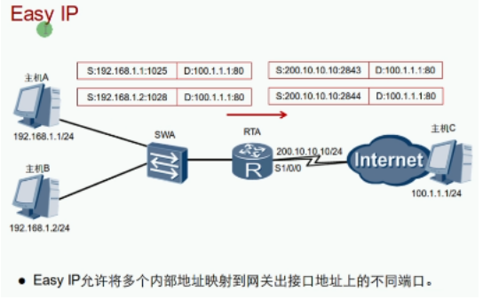
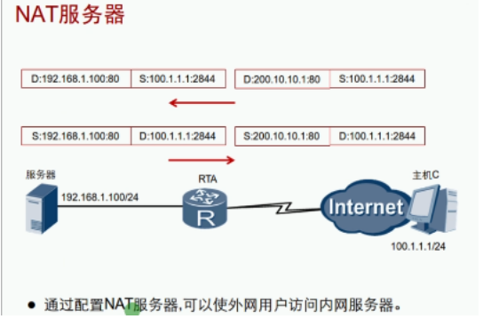

 **公网地址的由来**：个人/企业——>ISP运营商——>CNNIC中国互联网络信息中心——>APNIC（Asia Pacific Network Information Centre）亚太地址网络信息中心——>IANA互联网数字分配机构 （早在2012年IP地址就已经分配完了）

没有NAT技术，私网地址数据可以出去，但是回不来（无回程路由）

私网地址不可能出现在公网上（太多私网地址重复，设备性能也不足以支持）

NAT地址转换缓存表：记录转换地址信息

NAT好处：
- 有效避免了来自外网的攻击，大大提高了网络安全性
- 控制内外访问外网，同时也控制外网访问内网，解决了内网和外网通信的问题

家庭路由器和运营商路由器的区别：
1. 记录NAT缓存需要消耗大量的内存，CPU，导致上网速度慢（待机数量）
2. 带宽和包转发

NAT类型：NAT的实现方式有很多种，适用于不同的场景

- 静态NAT实现了私有地址和公有地址的一对一映射（一对一）
- 一个公网IP只会分配唯一固定的内网主机
- 如果希望一台主机专用某个公网地址，或者想要外网访问内网服务器时，可以使用静态NAT
- 静态NAT不能有效缓解公网地址短缺的问题

**静态NAT**配置： 

| 命令                                       | 备注              |
| ------------------------------------------ | ----------------- |
| nat static enable                          | 开启NAT静态功能   |
| nat static global 公网地址 inside 私网地址 | 创建静态NAT       |
| display nat static                         | 验证静态NAT的配置 |

**动态NAT**

- 动态NAT基于地址池来实现私有地址和公有地址的转换（多对多）
- 动态NAT定义了地址池，规定一个范围的地址可以供主机转换
- 动态NAT地址池中的地址用尽后，只能等待被占用的地址被释放，其他主机才能使用它来访问公网
- 动态NAT也不能有效缓解公网地址短缺的问题

（使用ICMP时地址会变换，是没有端口的，但是有标识，可以根据标识来分辨）

- NAPT允许多个内部地址映射到同一个公有地址的不同端口（多对一）
- NAPT（Network Address Port Translation）也称为NAT-PT或PAT 网络地址端口转换
- 通常适用于大型企业网络（申请多个固定的公网地址）
- NAPT需要定义地址池，不能直接使用出接口的地址
- 有效的缓解了公网地址短缺的问题

动态NAT和PAT配置：（命令语句后不跟no-pat即为PAT模式，多对一）

| 命令                                                         | 备注                                                         |
| ------------------------------------------------------------ | ------------------------------------------------------------ |
| nat address-group 编号 公网地址范围 eg:nat address-group 1 12.0.0.50 12.0.0.100 | 配置NAT地址池                                                |
| nat outbound acl 编号 address-group 编号 [no-pat] eg: nat outbound 2000 address-group 1 no pat | 关联一个ACL和一个NAT地址池（所以要先配置ACL的规则，允许哪些主机或网段可以上网）ACL用来匹配能够转换的源地址 |
| no-pat                                                       | 只转换地址而不转换端口                                       |
| nat outbound acl 编号  address-group 编号                | 配置NAPT                                                     |
| display nat address-group                                    | 查看NAT地址池配置信息                                        |
| display nat outbound                                         | 查看动态NAT配置信息                                          |
| display nat session all                                      | 查看所有NAT会话内容                                          |

**Easy IP**：以出接口公网IP地址作为NAT的地址（SNAT）源端口转换

- 直接使用出接口的地址做转换
- Easy IP适用于小规模居于网中的主机访问Internet的场景
- 如：家庭、小型网吧、小型办公室中，这些地方内部主机不多，出接口可以通过拨号方式获取一个临时公网IP地址
- 有效的缓解了公网地址紧缺和不固定的公网地址转换问题

Easy IP 与NAPT的区别
- Easy IP直接把内部地址映射到网关出口地址上的不同端口，直接使用公网端口进行转发
- 不需要像NAPT那样创建公网地址池，也不需要知道公网地址池是多少

Easy IP配置：

| 命令                  | 备注                          |
| --------------------- | ----------------------------- |
| nat outbound acl 编号 | 配置Easy IP 关联出站接口和ACL |

NAT服务器=端口映射=目的端口转换（DNAT转换）
能够实现外网地址访问内网地址的方法：NAT、VPN

- NAT具有“屏蔽”内部主机的作用，但有时内网需要向外网提供服务
- 当外网用户访问内网服务器时，出口设备通过事先配置好的“公网IP地址+端口号”与“私网IP地址+端口号”间的映射关系，将服务器的“公网IP地址和端口号”根据映射关系替换成对应的“私网IP地址+端口号”
- NAT服务器的公网IP地址和端口中，端口可以更改，提供安全性

NAT服务器配置：

| 命令                                                         | 备注                                                         |
| ------------------------------------------------------------ | ------------------------------------------------------------ |
| nat server protocol tcp/udp global 公网地址 端口 inside 私网地址 端口 | 配置NAT服务器                                                |
| nat server protocol tcp  global current-interface 端口 inside 私网地址 端口 | 如果提供的服务地址=出接口地址，需要打current-interface命令，不能打公网地址 |
| display nat server                                           | 查看NAT服务器                                                |

