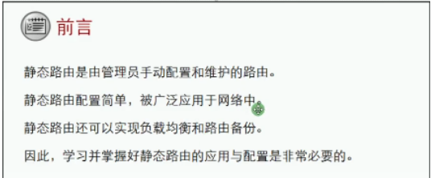
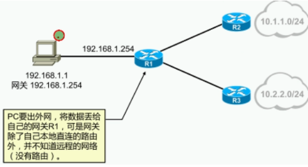
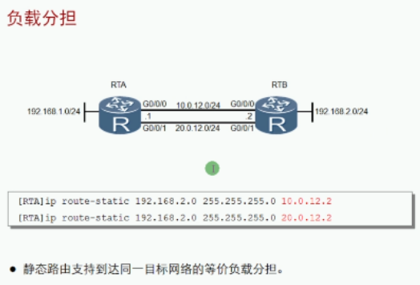
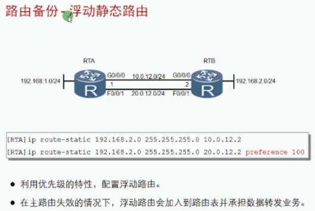
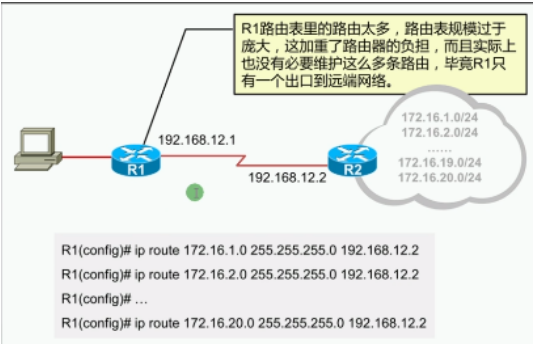
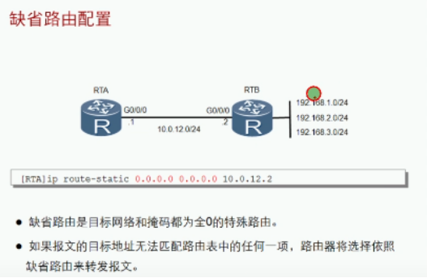

技术背景：如果只有直连路由，那么非直连网络就无法到达

静态路由**概述**：
- 配置简单、开销小
- 通过手动配置进行添加和维护
- 无法根据拓扑的变化而自适应
- 适合于组网规模较小的场景，在大型网络环境，则配置及维护成本很高
- 在大型网络中，往往采用动、静态路由结合的方式部署网络

静态路由配置**命令**：

| 命令                                                 | 备注         |
| ---------------------------------------------------- | ------------ |
| Ip route-static 目标网络 子网掩码/前缀 下一跳/出接口 | 配置静态路由 |

实现流量负载分担，提高链路利用率

优先级高的为活跃，优先级低的为非活跃
主链路故障，备份链路激活

**缺省路由**（网关）：一种特殊的路由，能匹配所有目标网络

