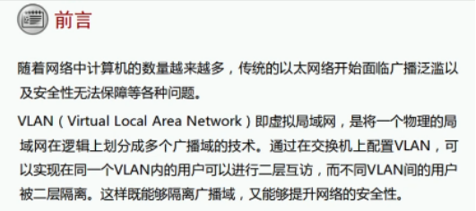

VLAN技术背景：

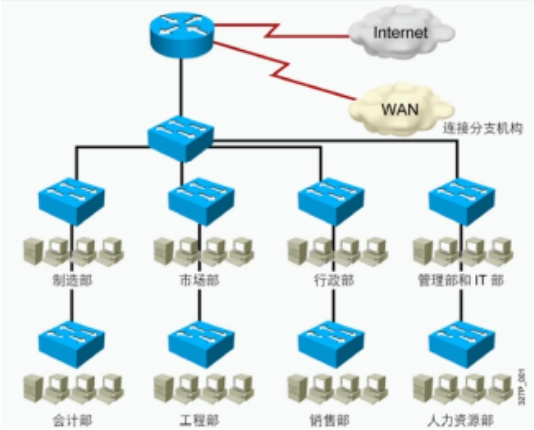

划分VLAN，将广播域范围减小

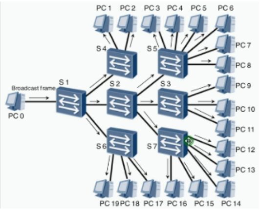

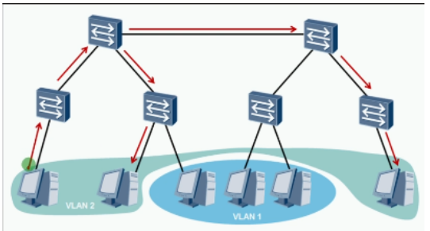

VLAN优点：
- 有效控制广播域范围
- 增强局域网的安全性
- 灵活构建虚拟工作组
- 简化网络管理

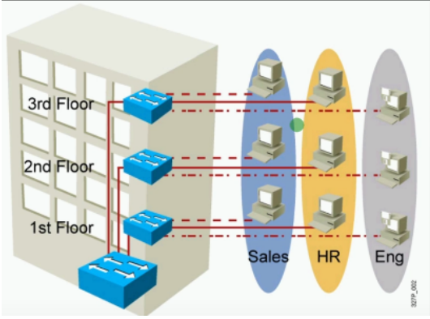

VLAN**概述**：Virtual LAN 虚拟局域网
- 将一个物理局域网在逻辑上划分成多个广播域
- 1 VLAN = 1 广播域 = 1 子网 （划分最好一个子网一个VLAN）
- 广播不会在不同VLAN间转发，而是限制在相同的VLAN中
- 不同VLAN间的设备默认无法通信

VLAN**范围**：0~4095 （0和4095保留，1为默认）

VLAN**划分**：基于端口最常见
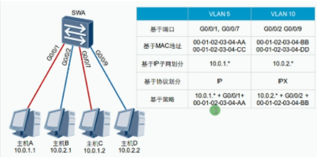

 

VLAN**标签**介绍：
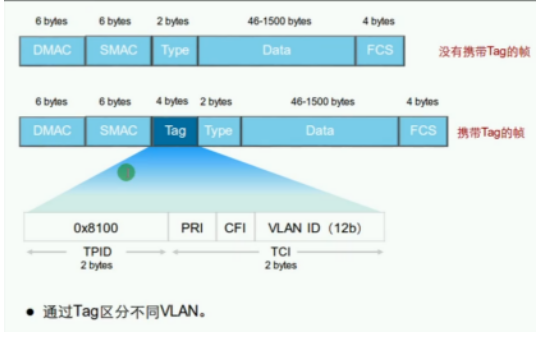

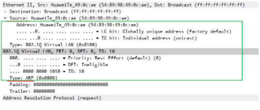

IEEE 802.1q：又称dot1q，是VLAN的正式标准，对Ethernet帧格式进行修改，在源Mac地址字段和协议类型字段中插入了4字节的802.1q Tag
每台支持802.1q协议的交换机发送的数据帧都会包含VLAN ID，以指明数据帧属于哪一个VLAN。因此，在一个VLAN交换网络中，以太网帧有以下两种格式

|  |  |
| -------------------------- | ----------------------------------------- |
| 无标记帧（untagged frame） | 原始的数据帧，未加入4字节802.1q tag的字段 |
| 有标记帧（tagged frame）   | 插入了4字节802.1q tag的字段               |

路由器和终端设备发送的数据帧默认是untagged frame，默认也识别不了tagged frame

VLAN链路类型：

| 类型                    | 备注                                                         |
| ----------------------- | ------------------------------------------------------------ |
| Access Link 接入链路    | 一般用于连接主机或路由器之间的链路接入链路上传输的帧都是untagged帧 |
| Trunk Link干道/中继链路 | 一般用于交换机间的互连或交换机与路由器之间的链路干道链路上传输的帧几乎都是tagged帧用于两端识别 |

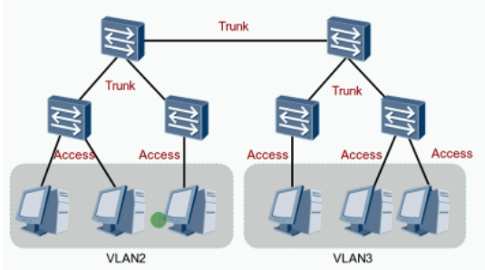

 PVID：Port Vlan identification 端口缺省VLAN
指明该接口属于的VLAN
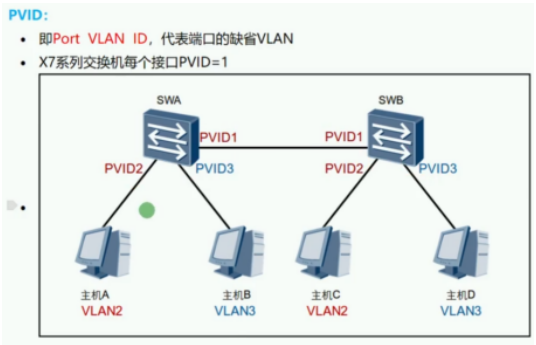

VLAN端口类型：

| 类型                                                       | 备注 Untagged 未打标签 Tagged 打标签                         |
| ---------------------------------------------------------- | ------------------------------------------------------------ |
| Access接入端口                                             | 用于连接主机收到数据后会添加VLAN Tag，VLAN ID和端口的PVID相同转发数据前会移除VLAN Tag注意：终端设备（PC）发出和接收的都是untagged的帧，否则无法识别 |
| 图例主机AC属于一个VLAN，B属于另一个VLAN,A与C相互通讯的演示 |  |
| Trunk干道端口                                              | 用于连接交换机或路由器收到帧时：如果该帧不包含Tag，将打上端口的PVID；如果该帧包含Tag，则不改变。发送帧时：首先要保证该帧的VLAN ID在Trunk的允许发送列表中（华为默认只允许VLAN1，思科默认允许所有VLAN)若与端口的PVID相同时，则剥离Tag发送；若与端口的PVID不同时，则直接发送。 |
| 图例主机A与C通信，主机B与D通信                             | 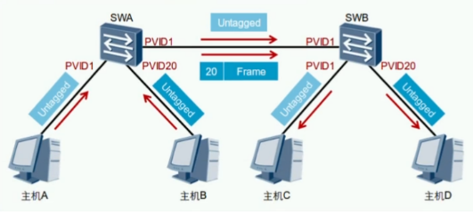 |
| Hybrid混杂端口                                             | 既可以连接主机，又可以连接其他交换机。既可以连接接入链路又可以连接干道链路。允许多个VLAN的帧通过，并可以在出接口方向将某些VLAN帧的Tag剥离掉（由命令决定） |
| 图例主机A与主机B不能相互访问，但都可以访问PVID100的服务器  |  |

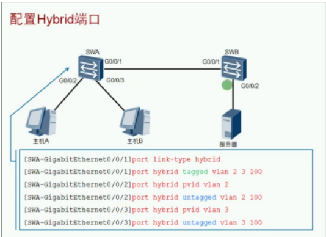

交换机之间的g0/0/1口可以打标签也可以不打标签，打标签就是Trunk模式，不打就是Acess模式

即 port hybrid tagged vlan 2 3 100这条命令可以不写

**Access端口白话解释：**
交换机每个接口有PVID，默认PVID=1，可以修改。
当接口为Access模式时：
- 收到未打标签（untagged）的帧会添加接口的PVID
- 收到打标签（tagged）的帧会直接修改为tagged帧的VLAN Tag
- 发帧时统一剥离VLAN Tag（Untagged）并与发送接口的PVID比较，一致转发不一致丢弃

**Trunk端口白话解释：**
交换机每个接口有PVID，默认PVID=1，可以修改。
接口为Trunk模式时：
- 收到未打标签的帧，将打上端口的PVID（和access模式一样）
- 收到打标签的帧，则不改变直接转发
- 发送帧时，先检查该帧VLAN ID在Trunk的允许发送列表
- 若发送的帧与端口的PVID相同，剥离Tag发送；（和access模式一样）
- 若与端口的PVID不同时，则直接发送。

**Hybrid端口白话解释：**（华为私有接口）
- 交换机每个接口有PVID，默认PVID=1，可以修改。
- 可以任意指定数据帧发送或接收是否携带tagged
- 接口属于混杂模式，既可以是Trunk又可以是Acess
- 收帧时既可以打上标签（Access），也可以直接转发带标签的帧（Trunk）
- 发帧时既可以直接转发带标签的帧（Trunk），也可以剥离标签（Acess）

交换机判断VLAN的逻辑：
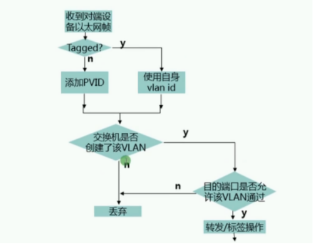

VLAN配置：

| 命令                                                         | 备注                                                       |
| ------------------------------------------------------------ | ---------------------------------------------------------- |
| vlan 10                                                      | 创建单个VLAN                                               |
| vlan batch 10 to 20                                          | 创建多个VLAN                                               |
| port link-type accessport link-type trunkport link-type hybrid | 配置接口类型简写为P L A、P L T、P L H                      |
| port default vlan 10                                         | 配置access关联的VLAN/PVID,简写 P D V 10                    |
| port trunk allow-pass vlan 10                                | 配置Trunk允许通过的VLAN，简写P L A V 10华为默认只允许VLAN1 |
| port trunk pvid vlan 10                                      | 配置Trunk的PVID                                            |
| port hybrid tagged vlan 10port hybrid untagged vlan 10       | 配置Hybird标记VLAN（标记和剥离）                           |
| port hybrid pvid vlan 10                                     | 配置Hybird的PVID                                           |
| display vlan                                                 | 验证VLAN                                                   |
| display port vlan 10                                         | 验证VLAN                                                   |

交换机的工作原理：
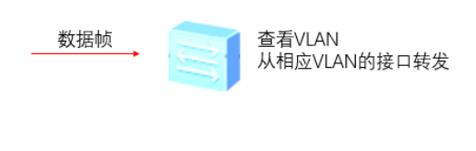

# VLAN间路由

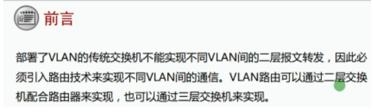

VLAN间通信限制：每一个VLAN都是独立的广播域，不同VLAN之间隔离，因此不同VLAN的节点之间是无法直接访问
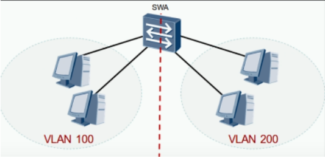

 

VLAN间通信方法（路由）：

使用路由器完成不同VLAN通信 （缺点：每一个VLAN就需要绑定一个物理接口）
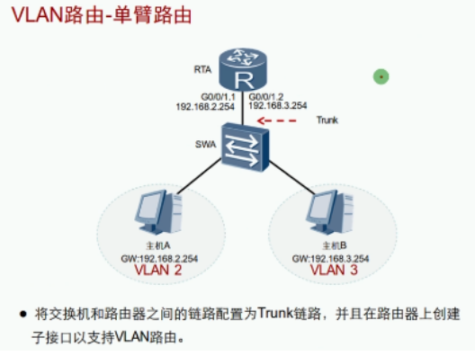

使用一个接口的子接口（虚拟接口），来绑定VLAN大大减少了资源消耗

交换机设置为Trunk，路由器如何识别VLAN？

**dot1q termination vid 10 作用**：该子接口与VLAN10绑定，收到VLAN10就剥离VLAN，查看路由表执行路由转发，转发在打上转发接口的PVID

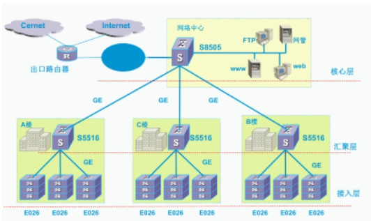

路由器一般用作出口设备（广播域太大），且价格较贵，使用路由器实现VLAN间通信不经济

使用具有路由功能的交换机实现VLAN间通信

VLAN配置：

| 命令                                | 备注                                         |
| ----------------------------------- | -------------------------------------------- |
| Vlan 10                             | 创建单个VLAN                                 |
| Vlan batch 10 20                    | 创建多个VLAN                                 |
| Port link-type access/trunk/hybrid  | 配置接口类型                                 |
| Port default vlan 10                | 配置access关联VLAN/PVID                      |
| Port trunk allow-pass vlan 10       | 配置trunk允许VLAN通过（默认只允许VLAN1通过） |
| Port trunk pvid vlan 10             | 配置trunk的PVID                              |
| Port hybrid tagged/untagged vlan 10 | 配置hybrid标记VLAN                           |
| Port hybrid pvid vlan 10            | 配置hybrid的PVID                             |
| Display vlan                        | 验证VLAN                                     |
| Display port vlan                   | 验证VLAN                                     |
| Dot1q termination vid 10            | 子接口和VLAN关联                             |
| Arp broadcast enable                | 开启子接口的ARP广播功能                      |
| portswitch                          | 配置接口工作为2层                            |
| Undo portswitch                     | 配置接口工作为3层                            |

