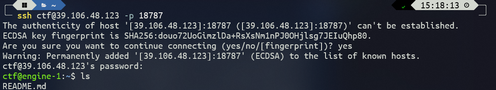

## 题目描述

目标检测技术广泛应用于视频监控、智能驾驶等安全关键型领域，因此
检验目标检测模型的脆弱性至关重要。对抗补J攻击通过修改图像的局
部区域来达到欺骗目标检测模型的目的，是最实用的攻击方法之一。在
现实世界中，攻击者可以在路牌上贴上精心设计的贴纸或者制作具有补
1 J图案的衣服来欺骗目标检测器。本题目考虑对目标检测模型的对抗
补丁攻击，要求选手通过添加补J使检测框消失，避开检测，同时要求
修改的图像区域尽可能小。为实现这一目标， 补J的形状、位置、纹理
等都是需要考虑的因素。
(请点击“下发赛题”
本题容器下发后的端是ssh端口，ssh的账号为ctf,密
码为gamelab ; ssh登录上去可自行修改密码。请仔细阅读/home/ctf/README.
md文件以及源代码文件)

## 解题

按照题目要求登录服务器

查看文件README.md

