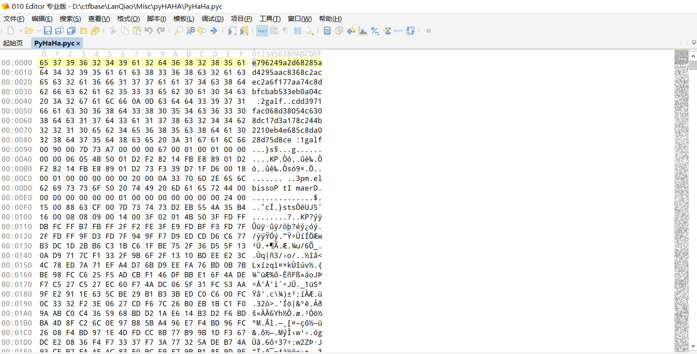
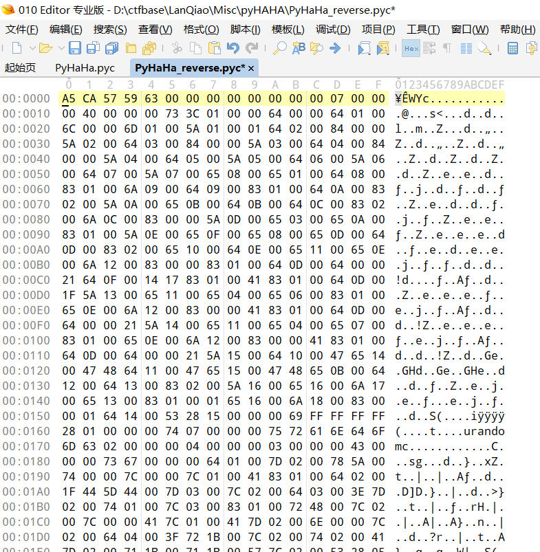
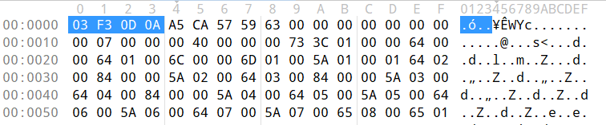
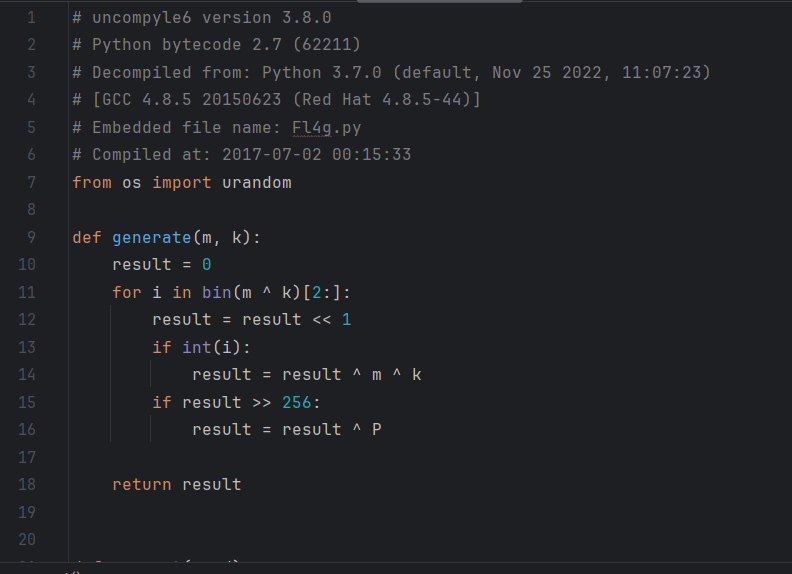

## 题目描述


## 解题
下载附件，一个`pyc`文件，放入010editor中查看：


可以看到几个关键信息flag1和flag2、和一个MP3文件，
正常的pyc文件一般不会有这么大，猜测里面还有其他文件比如那个MP3文件
但是观察010editor数据，可以看到文件中的数据好像是反过来的；编写一个python小脚本反过来
```python
with open("D:/ctfbase/LanQiao/Misc/pyHAHA/PyHaHa_reverse.pyc", "wb") as file:  
    with open("D:/ctfbase/LanQiao/Misc/pyHAHA/PyHaHa.pyc", "rb") as f:  
        file.write(f.read()[::-1])
```

得到正常的数据文件：


可以看到缺少了pyc文件头，但是并不知道python版本不知道他的文件头
根据CTF题目经验，猜测可能是2.7、3.7、3.8这几个版本中的一个

其中
> 2.7版本文件头：03F3 0D0A
> 3.8版本文件头：550D 0D0A

添加文件头用python相应版本的uncompyle6反编译，或者使用pyc在线反编译网站：

> [python反编译 - 在线工具 (tool.lu)](https://tool.lu/pyc/)
> [pyc反编译 - 工具匠 (toolkk.com)](https://www.toolkk.com/tools/pyc-decomplie)



得到源文件：


根据源代码输出可知`flag1`和`flag2`的结果即为文件末尾的数据：
`flag1=ec8d57d820ad8c586e4be0122b442c871a3d71cd8036c45083d860caf1793ddc`
`flag2=c40a0be335babcfbd8c47aa771f6a2ceca2c8638caa5924da58286d2a942697e`

