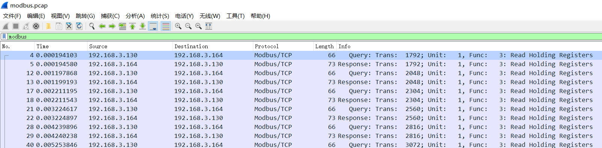
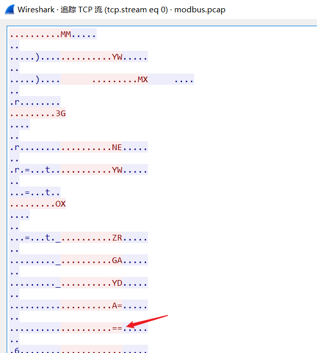
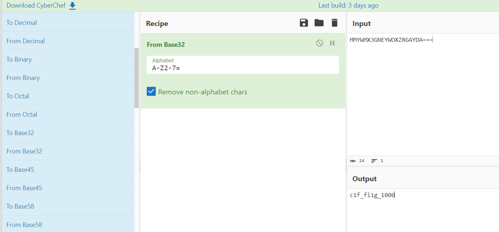

## 题目描述

某安全部门发现某涉密工厂生产人员偷偷通过生产网络传输数据给不明人员，通过技术手段截获出一段通讯流量，但是其中的关键信息被进行了加密，请你根据流量包的内容，找出被加密的信息。（得到的字符串需要以flag{xxx}形式提交）

## 解题

下载附件，发现附件名叫`modbus`；猜测与`modbus`协议有关。

用`wireshark`打开，筛选`modbus`协议：

点击追踪TCP流发现base系列编码特征：

根据特征：都是大写并且有三个`=`，猜测是`base32`编码：

进行`base32`解码：

没有乱码，尝试`flag`正确

得到`flag{c1f_fi1g_1000}`

## 补充

> base系列编码特征：
>
> 1. base16：编码表为**0-9和A-F**共**2^4=16**个字符；不足位数补**0**；通常不需要“=”填充；
> 2. base32：编码表为**2-7和A-Z**共**2^5=32**个字符；需要“=”填充，通常为0个、1个、3个、4个、6个；
> 3. base58：编码表为**0-9和A-Z、a-z并去掉'O''0'和'I''l'等相似字符**共**58**个字符；通常不需要“=”填充；
> 4. base64：编码表为**A-Z、a-z0-9+/=**共**2^6=64**个字符；不满3的倍数用“=”补齐。