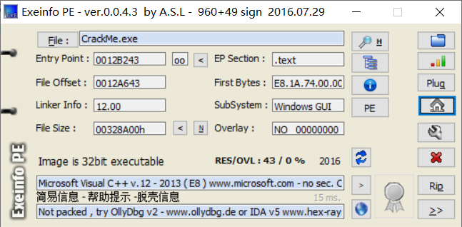
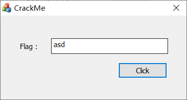
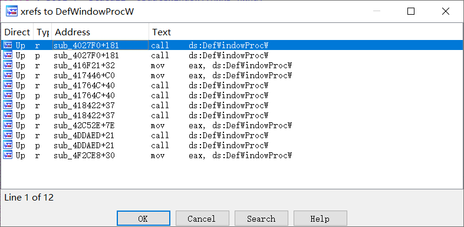
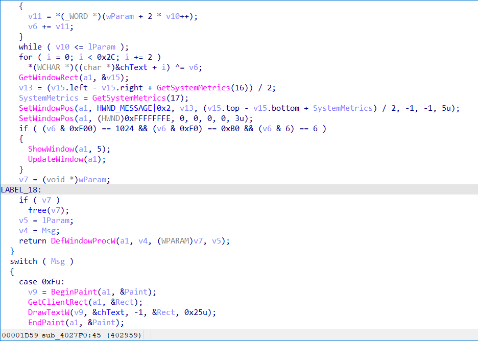
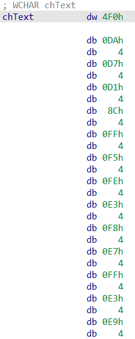

## 题目描述
CrackMe01
flag加上flag{}

## 解题
下载附件，是通过Windows API写的程序，放入exeinfope中查看：


无壳32位，扔入IDA
因为是Windows API程序，着重根据程序特征筛选API函数，打开软件：


可以看到点击按钮也没有错误弹窗，猜测只有在flag正确时才会弹窗，
则筛选API函数`DefWindowProcW`，该函数会在程序中创建一个新窗口。

使用交叉引用找到程序主代码：


F5反汇编：


忽略其他无用函数，得到主要加密代码：
```c++
for ( i = 0; i < 0x2C; i += 2 )
      *(WCHAR *)((char *)&chText + i) ^= v6;
if ( (v6 & 0xF00) == 1024 && (v6 & 0xF0) == 0xB0 && (v6 & 6) == 6 )
    {
      ShowWindow(a1, 5);
      UpdateWindow(a1);
    }
```

先提取chText数组：


注意按照第一个**数据的格式**提取后面的数据：
得到chText数组和v6：
```c++
int chText[] = {0x4F0, 0x4DA, 0x4D7, 0x4D1, 0x48C, 0x4FF, 0x4F5, 0x4FE, 0x4E3, 0x4F8, 0x4E7, 0x4FF, 0x4E3, 0x4E9, 0x4F0, 0x4F3, 0x485, 0x480, 0x484, 0x4F2, 0x4F4, 0x4F3};
int v6 = 0xFB6;
```

编写脚本：
```c++
#include<iostream>

using namespace std;

int main()
{
    int chText[] = {0x4F0, 0x4DA, 0x4D7, 0x4D1, 0x48C, 0x4FF, 0x4F5, 0x4FE, 0x4E3, 0x4F8, 0x4E7, 0x4FF, 0x4E3, 0x4E9, 0x4F0, 0x4F3, 0x485, 0x480, 0x484, 0x4F2, 0x4F4, 0x4F3};
    int v6 = 0xFB6;
    char flag[] = "";

    for (int i = 0; i < 0x2c; i++)
    {
        flag[i] = v6 ^ chText[i];
    }
    cout << flag;
}
// Flag:ICHUNQIU_FE362DBE
```

得到`flag{ICHUNQIU_FE362DBE}`