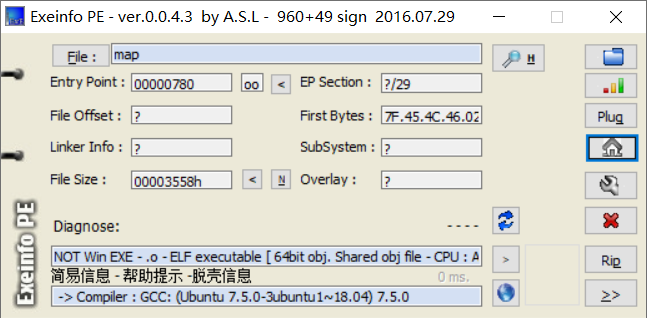
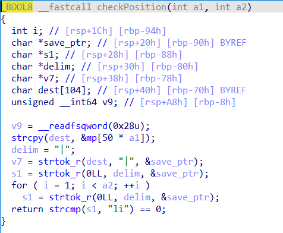
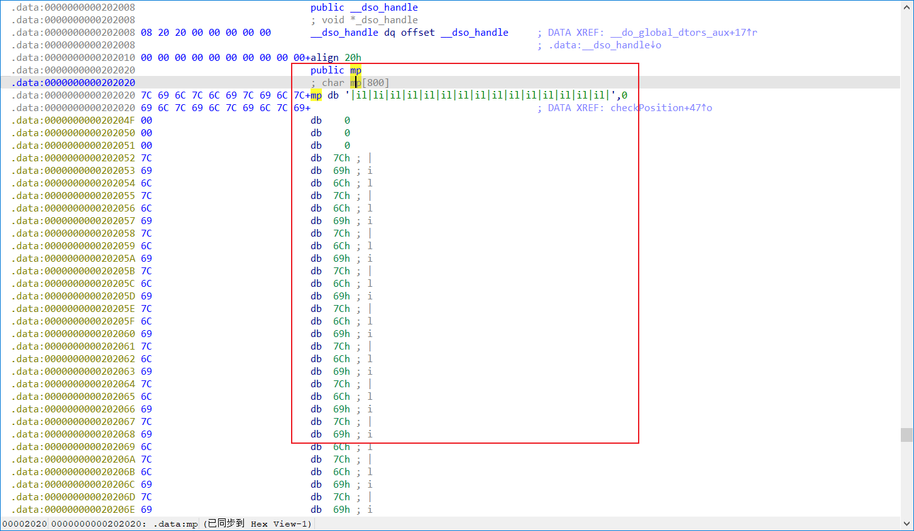
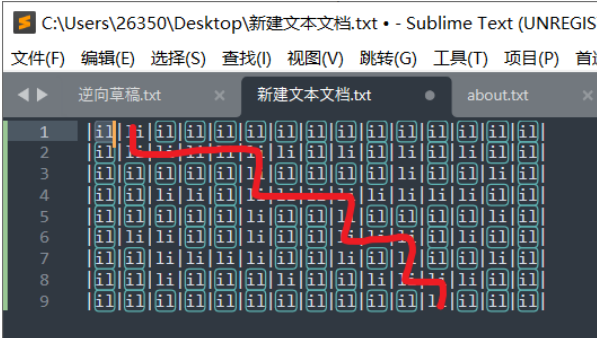

## 题目描述

小蓝同学发给你一个可执行文件，你运行后发现是一个简单的迷宫游
戏，你没有办法看到迷宫的全貌，只能通过键盘控制你的移动。你意识
到需要用逆向工具来分析它，看看是否能找到隐藏在其中的迷宫地图，
并且找出最短的移动路径。

## 解题

根据题目描述可以知道该题与迷宫有关，所以之后分析可以着重找到迷宫地图。

扔入`exeinfope`中查看基本信息：`C语言`编写的`elf64`位`linux`程序



放入`64`位的`IDA`中查看，找到`main`函数，按`F5`反汇编


可以看出`flag`是我们输入的字符串的`32`位小端（小端就是小写，大端就是大写）`md5`值，再根据题目描述猜测我们输入的m字符串就是走出迷宫的最短路径！！！

分析程序，在`switch`语句中发现一个出现最多的函数`checkPosition`，双击进入



在其中发现一个`mp`数组双击进入发现就是我们需要的迷宫地图，



将`mp`数组全部选中，然后在编辑中找到导出数据可以根据需要快速导出数据，可以根据导出的数据用`C`语言（其他语言也可）编写脚本快速打印地图，此处还需注意由于`mp`数组第一行并未用`16`进制表示所以导出数据时并不会将其导出之后需自行加上脚本如下：

```c
#include <stdio.h>
#include <stdlib.h>
#include <string.h>

int main(){
    int map [] = {0x7C, 0x69, 0x6C, 0x7C, 0x6C, 0x69, 0x7C, 
  0x6C, 0x69, 0x7C, 0x6C, 0x69, 0x7C, 0x6C, 0x69, 0x7C, 0x6C, 
  0x69, 0x7C, 0x6C, 0x69, 0x7C, 0x69, 0x6C, 0x7C, 0x6C, 0x69, 
  0x7C, 0x69, 0x6C, 0x7C, 0x6C, 0x69, 0x7C, 0x69, 0x6C, 0x7C, 
  0x6C, 0x69, 0x7C, 0x69, 0x6C, 0x7C, 0x69, 0x6C, 0x7C, 0x00, 
  0x00, 0x00, 0x00, 0x7C, 0x69, 0x6C, 0x7C, 0x69, 0x6C, 0x7C, 
  0x69, 0x6C, 0x7C, 0x69, 0x6C, 0x7C, 0x69, 0x6C, 0x7C, 0x6C, 
  0x69, 0x7C, 0x69, 0x6C, 0x7C, 0x69, 0x6C, 0x7C, 0x69, 0x6C, 
  0x7C, 0x69, 0x6C, 0x7C, 0x6C, 0x69, 0x7C, 0x69, 0x6C, 0x7C, 
  0x69, 0x6C, 0x7C, 0x6C, 0x69, 0x7C, 0x69, 0x6C, 0x7C, 0x00, 
  0x00, 0x00, 0x00, 0x7C, 0x69, 0x6C, 0x7C, 0x69, 0x6C, 0x7C, 
  0x6C, 0x69, 0x7C, 0x6C, 0x69, 0x7C, 0x69, 0x6C, 0x7C, 0x6C, 
  0x69, 0x7C, 0x6C, 0x69, 0x7C, 0x6C, 0x69, 0x7C, 0x6C, 0x69, 
  0x7C, 0x6C, 0x69, 0x7C, 0x6C, 0x69, 0x7C, 0x6C, 0x69, 0x7C, 
  0x6C, 0x69, 0x7C, 0x69, 0x6C, 0x7C, 0x69, 0x6C, 0x7C, 0x00, 
  0x00, 0x00, 0x00, 0x7C, 0x69, 0x6C, 0x7C, 0x69, 0x6C, 0x7C, 
  0x69, 0x6C, 0x7C, 0x69, 0x6C, 0x7C, 0x69, 0x6C, 0x7C, 0x6C, 
  0x69, 0x7C, 0x69, 0x6C, 0x7C, 0x69, 0x6C, 0x7C, 0x6C, 0x69, 
  0x7C, 0x69, 0x6C, 0x7C, 0x69, 0x6C, 0x7C, 0x69, 0x6C, 0x7C, 
  0x69, 0x6C, 0x7C, 0x6C, 0x69, 0x7C, 0x69, 0x6C, 0x7C, 0x00, 
  0x00, 0x00, 0x00, 0x7C, 0x69, 0x6C, 0x7C, 0x6C, 0x69, 0x7C, 
  0x6C, 0x69, 0x7C, 0x69, 0x6C, 0x7C, 0x69, 0x6C, 0x7C, 0x6C, 
  0x69, 0x7C, 0x69, 0x6C, 0x7C, 0x69, 0x6C, 0x7C, 0x6C, 0x69, 
  0x7C, 0x6C, 0x69, 0x7C, 0x6C, 0x69, 0x7C, 0x69, 0x6C, 0x7C, 
  0x6C, 0x69, 0x7C, 0x69, 0x6C, 0x7C, 0x69, 0x6C, 0x7C, 0x00, 
  0x00, 0x00, 0x00, 0x7C, 0x69, 0x6C, 0x7C, 0x69, 0x6C, 0x7C, 
  0x6C, 0x69, 0x7C, 0x6C, 0x69, 0x7C, 0x6C, 0x69, 0x7C, 0x6C, 
  0x69, 0x7C, 0x69, 0x6C, 0x7C, 0x69, 0x6C, 0x7C, 0x6C, 0x69, 
  0x7C, 0x69, 0x6C, 0x7C, 0x6C, 0x69, 0x7C, 0x69, 0x6C, 0x7C, 
  0x69, 0x6C, 0x7C, 0x6C, 0x69, 0x7C, 0x69, 0x6C, 0x7C, 0x00, 
  0x00, 0x00, 0x00, 0x7C, 0x69, 0x6C, 0x7C, 0x69, 0x6C, 0x7C, 
  0x6C, 0x69, 0x7C, 0x69, 0x6C, 0x7C, 0x69, 0x6C, 0x7C, 0x69, 
  0x6C, 0x7C, 0x6C, 0x69, 0x7C, 0x69, 0x6C, 0x7C, 0x69, 0x6C, 
  0x7C, 0x6C, 0x69, 0x7C, 0x6C, 0x69, 0x7C, 0x6C, 0x69, 0x7C, 
  0x6C, 0x69, 0x7C, 0x69, 0x6C, 0x7C, 0x69, 0x6C, 0x7C, 0x00, 
  0x00, 0x00, 0x00, 0x7C, 0x69, 0x6C, 0x7C, 0x69, 0x6C, 0x7C, 
  0x69, 0x6C, 0x7C, 0x69, 0x6C, 0x7C, 0x69, 0x6C, 0x7C, 0x69, 
  0x6C, 0x7C, 0x69, 0x6C, 0x7C, 0x69, 0x6C, 0x7C, 0x69, 0x6C, 
  0x7C, 0x69, 0x6C, 0x7C, 0x69, 0x6C, 0x7C, 0x6C, 0x69, 0x7C, 
  0x69, 0x6C, 0x7C, 0x69, 0x6C, 0x7C, 0x69, 0x6C, 0x7C};

  for (int i = 0; i < 396; i++){
    if (map[i] == 0){
        printf("\n");
        i += 3;        //为了输出正确n行n列的迷宫地图
    }
    printf("%c", map[i]);
  }
    return 0;
}
/*
输出结果：
|il|li|li|li|li|li|li|il|li|il|li|il|li|il|il|
|il|il|il|il|il|li|il|il|il|il|li|il|il|li|il|
|il|il|li|li|il|li|li|li|li|li|li|li|li|il|il|
|il|il|il|il|il|li|il|il|li|il|il|il|il|li|il|
|il|li|li|il|il|li|il|il|li|li|li|il|li|il|il|
|il|il|li|li|li|li|il|il|li|il|li|il|il|li|il|
|il|il|li|il|il|il|li|il|il|li|li|li|li|il|il|
|il|il|il|il|il|il|il|il|il|il|il|li|il|il|il|
*/
```


在加上第一行迷宫组成完整迷宫，在放在文本编辑器（`Sublime Text`或其它）中进行处理便于观察迷宫，可以看到`il`代表的是墙，`li`代表的是路，所以得到正确走出迷宫的路径：`sddddssdddssddssds`，

放入`md5`在线生成网站

得到`flag{6cc4fc7f5f2127cae570b4337c3db20f}`

