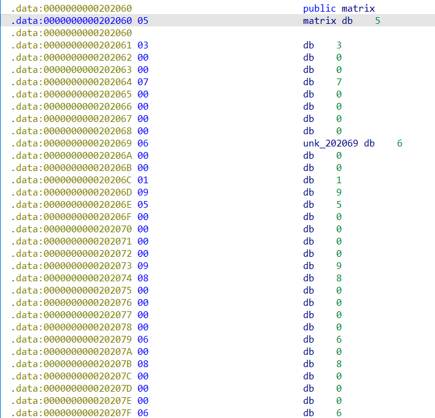
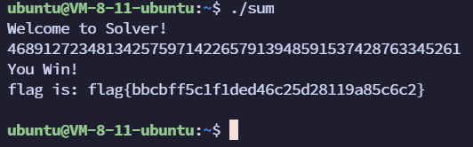

## 题目描述

数字游戏

## 解题

拖入`exeinfope`，查看文件属性，无壳64位elf程序，拖入64位IDA分析代码

```c
int __cdecl main(int argc, const char **argv, const char **envp)
{
  char *v3; // rbp
  int v4; // r14d
  unsigned int v5; // r12d
  __int64 i; // rbx
  char v7; // al
  int v8; // eax
  const char *v9; // rax

  v3 = (char *)&matrix;
  v4 = 1;
  v5 = 0;
  puts("Welcome to Solver!");
  do
  {
    for ( i = 0LL; i != 9; ++i )
    {
      if ( !v3[i] )
      {
        v7 = getchar();
        if ( (unsigned __int8)(v7 - 49) > 8u )    //减49是因为v7是字符类型，需转换为数字计算
          v4 = 0;
        else
          v3[i] = v7 - 48;
      }
      v8 = v3[i];
      v5 += v8;
    }
    v3 += 9;
  }
  while ( v3 != (char *)&matrix + 81 );
  if ( v4 && (unsigned int)verify("Welcome to Solver!", argv) )    //调用verify函数判断正确性
  {
    puts("You Win!");
    __snprintf_chk(buf, 32LL, 1LL, 32LL, "%d", v5);
    v9 = (const char *)str2md5(buf, strlen(buf));
    __printf_chk(1LL, "flag is: flag{%s}\n\n", v9);
    exit(0);
  }
  puts("Again~");
  return 0;
}
```


分析程序，可以看出我们的`flag`并不是我们自己输入的，而是通过一个for循环让我们输入一个字符串，正确之后程序会给我们`flag`，所以不难猜测`v7`就是这个游戏的正确答案，进入`verify`函数：

咳咳，发现看不懂别慌，可以看到两个函数有一个都用过的变量`matrix`，点击可以看到一个长度为9的数组，在后面还有一个`unk_202069`变量在`verrify`函数中使用过：



再根据main函数的for循环，好像该程序是9位9位的进行验证，将这两个数组变量导出，整理一下，发现刚好是`9*9`的矩阵，在根据题目数字游戏和数组中的若干0，猜测可能是数独，数组中的0就只我们要填的正确答案，验证：

```c
int sum[] = {
    5, 3, 0, 0, 7, 0, 0, 0, 0, 
    6, 0, 0, 1, 9, 5, 0, 0, 0, 
    0, 9, 8, 0, 0, 0, 0, 6, 0, 
    8, 0, 0, 0, 6, 0, 0, 0, 3, 
    4, 0, 0, 8, 0, 3, 0, 0, 1, 
    7, 0, 0, 0, 2, 0, 0, 0, 6, 
    0, 6, 0, 0, 0, 0, 2, 8, 0, 
    0, 0, 0, 4, 1, 9, 0, 0, 5, 
    0, 0, 0, 0, 8, 0, 0, 7, 9
};
```


将该游戏发给`GPT`，让他给我们正确答案：

```c
int sum_jie[] = 
    {
        5, 3, 4, 6, 7, 8, 9, 1, 2,
        6, 7, 2, 1, 9, 5, 3, 4, 8,
        1, 9, 8, 3, 4, 2, 5, 6, 7,
        8, 5, 9, 7, 6, 1, 4, 2, 3,
        4, 2, 6, 8, 5, 3, 7, 9, 1,
        7, 1, 3, 9, 2, 4, 8, 5, 6,
        9, 6, 1, 5, 3, 7, 2, 8, 4,
        2, 8, 7, 4, 1, 9, 6, 3, 5,
        3, 4, 5, 2, 8, 6, 1, 7, 9
    };
```


在写解题程序，输出我们想要的答案：

```c
#include <stdio.h>
#include <stdlib.h>
#include <string.h>

int main(){
    int sum[] = 
    {
        5, 3, 0, 0, 7, 0, 0, 0, 0, 
        6, 0, 0, 1, 9, 5, 0, 0, 0, 
        0, 9, 8, 0, 0, 0, 0, 6, 0, 
        8, 0, 0, 0, 6, 0, 0, 0, 3, 
        4, 0, 0, 8, 0, 3, 0, 0, 1, 
        7, 0, 0, 0, 2, 0, 0, 0, 6, 
        0, 6, 0, 0, 0, 0, 2, 8, 0, 
        0, 0, 0, 4, 1, 9, 0, 0, 5, 
        0, 0, 0, 0, 8, 0, 0, 7, 9
    };
    int sum_jie[] = 
    {
        5, 3, 4, 6, 7, 8, 9, 1, 2,
        6, 7, 2, 1, 9, 5, 3, 4, 8,
        1, 9, 8, 3, 4, 2, 5, 6, 7,
        8, 5, 9, 7, 6, 1, 4, 2, 3,
        4, 2, 6, 8, 5, 3, 7, 9, 1,
        7, 1, 3, 9, 2, 4, 8, 5, 6,
        9, 6, 1, 5, 3, 7, 2, 8, 4,
        2, 8, 7, 4, 1, 9, 6, 3, 5,
        3, 4, 5, 2, 8, 6, 1, 7, 9
    };
    for (int i = 0; i < 81; i++){
        if (!sum[i]){
            printf("%d", sum_jie[i]);
        }
    }

    return 0;
}
```


可以看到这个for循环的格式与IDA编译出的main函数非常相似，最终得到游戏正确答案：`468912723481342575971422657913948591537428763345261`

运行程序（linux系统运行）输入字符串，得到`flag{bbcbff5c1f1ded46c25d28119a85c6c2}`

