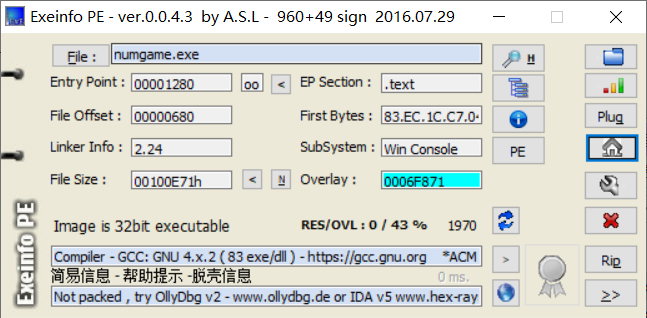
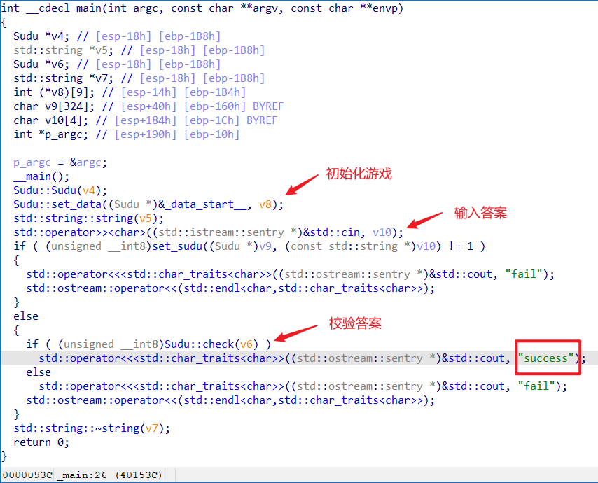
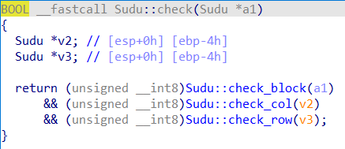
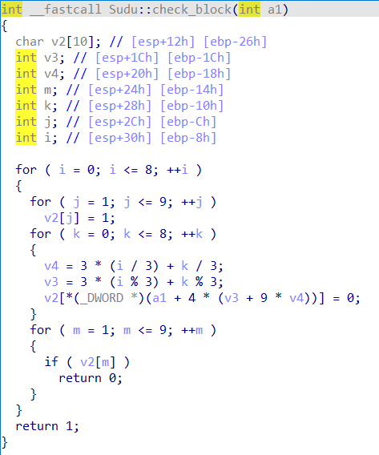
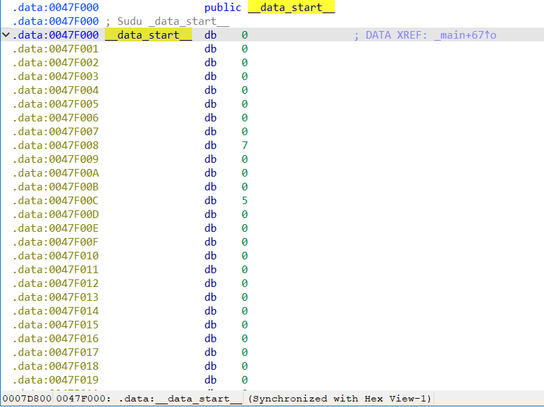
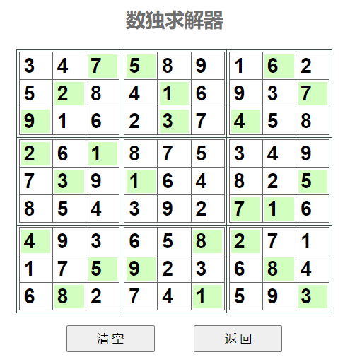

## 题目描述
答案加flag{}

## 解题
下载附件，一个exe程序，放入exeinfope：


32位程序，放入IDA32，找到主程序：


纯C++写法，执行流程很明确，打开check函数：




可以看到游戏校验时是9\*9的矩阵，想到是数独：
打开_data_start__数组是初始数独矩阵：


提取出来，得到数独：
```markdown
int sum[] = 
{
  0, 0, 7, 5, 0, 0, 0, 6, 0,
  0, 2, 0, 0, 1, 0, 0, 0, 7,
  9, 0, 0, 0, 3, 0, 4, 0, 0,
  2, 0, 1, 0, 0, 0, 0, 0, 0,
  0, 3, 0, 1, 0, 0, 0, 0, 5,
  0, 0, 0, 0, 0, 0, 7, 1, 0,
  4, 0, 0, 0, 0, 8, 2, 0, 0,
  0, 0, 5, 9, 0, 0, 0, 8, 0,
  0, 8, 0, 0, 0, 1, 0, 0, 3
}
```
注意程序中的数组是4位一组，只有一位有效，以下是提取脚本：
```c++
#include<iostream>

using namespace std;

int main()
{
    int map[] = {0, 0, 0, 0, 0, 0, 0, 0, 7, 0, 0, 0, 5, 0, 0, 0, 0, 0, 0, 0, 0, 0, 0, 0, 0, 0, 0, 0, 6, 0, 0, 0, 0, 0, 0, 0, 0, 0, 0, 0, 2, 0, 0, 0, 0, 0, 0, 0, 0, 0, 0, 0, 1, 0, 0, 0, 0, 0, 0, 0, 0, 0, 0, 0, 0, 0, 0, 0, 7, 0, 0, 0, 9, 0, 0, 0, 0, 0, 0, 0, 0, 0, 0, 0, 0, 0, 0, 0, 3, 0, 0, 0, 0, 0, 0, 0, 4, 0, 0, 0, 0, 0, 0, 0, 0, 0, 0, 0, 2, 0, 0, 0, 0, 0, 0, 0, 1, 0, 0, 0, 0, 0, 0, 0, 0, 0, 0, 0, 0, 0, 0, 0, 0, 0, 0, 0, 0, 0, 0, 0, 0, 0, 0, 0, 0, 0, 0, 0, 3, 0, 0, 0, 0, 0, 0, 0, 1, 0, 0, 0, 0, 0, 0, 0, 0, 0, 0, 0, 0, 0, 0, 0, 0, 0, 0, 0, 5, 0, 0, 0, 0, 0, 0, 0, 0, 0, 0, 0, 0, 0, 0, 0, 0, 0, 0, 0, 0, 0, 0, 0, 0, 0, 0, 0, 7, 0, 0, 0, 1, 0, 0, 0, 0, 0, 0, 0, 4, 0, 0, 0, 0, 0, 0, 0, 0, 0, 0, 0, 0, 0, 0, 0, 0, 0, 0, 0, 8, 0, 0, 0, 2, 0, 0, 0, 0, 0, 0, 0, 0, 0, 0, 0, 0, 0, 0, 0, 0, 0, 0, 0, 5, 0, 0, 0, 9, 0, 0, 0, 0, 0, 0, 0, 0, 0, 0, 0, 0, 0, 0, 0, 8, 0, 0, 0, 0, 0, 0, 0, 0, 0, 0, 0, 8, 0, 0, 0, 0, 0, 0, 0, 0, 0, 0, 0, 0, 0, 0, 0, 1, 0, 0, 0, 0, 0, 0, 0, 0, 0, 0, 0, 3, 0, 0, 0, 0, 0, 0, 0, 0, 0, 0, 0, 0, 0, 0, 0, 0, 0, 0, 0, 0, 0, 0, 0, 0, 0, 0, 0, 0, 0, 0, 0, 0, 0, 0, 0, 0, 0, 0, 0, 0, 0, 0, 0, 0, 0, 0, 0, 0, 0, 0, 0, 0, 0, 0, 0, 0, 0, 0, 0, 0, 0, 0, 0};
    for (int i = 0; i < 324; i += 4)
    {
        if (i % 36 == 0){
            cout << "\n";
        }
        if (i == 324 - 4){
            cout << map[i] << "\n";
        }
        else{
            cout << map[i] << ", ";
        }
        
    }
}
```

拿到在线解题数独网站得到正确数独：
[在线数独求解器 (gwalker.cn)](https://shudu.gwalker.cn/)


得到正确数独，编写脚本输出正确答案：
```c++
#include<iostream>

using namespace std;

int main()
{
    int sum[81] = 
        {
        0, 0, 7, 5, 0, 0, 0, 6, 0,
        0, 2, 0, 0, 1, 0, 0, 0, 7,
        9, 0, 0, 0, 3, 0, 4, 0, 0,
        2, 0, 1, 0, 0, 0, 0, 0, 0,
        0, 3, 0, 1, 0, 0, 0, 0, 5,
        0, 0, 0, 0, 0, 0, 7, 1, 0,
        4, 0, 0, 0, 0, 8, 2, 0, 0,
        0, 0, 5, 9, 0, 0, 0, 8, 0,
        0, 8, 0, 0, 0, 1, 0, 0, 3
        };
    int sum_right[81] = 
        {
        3, 4, 7, 5, 8, 9, 1, 6, 2, 
        5, 2, 8, 4, 1, 6, 9, 3, 7, 
        9, 1, 6, 2, 3, 7, 4, 5, 8, 
        2, 6, 1, 8, 7, 5, 3, 4, 9, 
        7, 3, 9, 1, 6, 4, 8, 2, 5, 
        8, 5, 4, 3, 9, 2, 7, 1, 6, 
        4, 9, 3, 6, 5, 8, 2, 7, 1, 
        1, 7, 5, 9, 2, 3, 6, 8, 4, 
        6, 8, 2, 7, 4, 1, 5, 9, 3
        };

    cout << "正确答案：";
    for (int i = 0; i < 81; i++){
        if (!sum[i]){
            cout << sum_right[i];
        }
    }
    
}
// 34891258469316275868753497964828543926936571172364627459
```

得到答案，但是校验flag却发现错误，再次检查代码，并没有发现加密输入字符串代码，猜测flag不止输出正确答案，
题目中原本的数字也要输出，但经过尝试发现也是错误

再次尝试将数独题目中的数字用**0**输出，得到正确答案，脚本如下：
```c++
cout << "正确答案：";
    for (int i = 0; i < 81; i++){
        if (!sum[i]){
            cout << sum_right[i];
        }else{
            cout << '0';
        }
    }
```

得到`flag{340089102508406930016207058060875349709064820854392006093650071170023604602740590}`
