网络概述：
- 硬件方面：通过介质（网线、无线……）将网络设备和终端设备连接起来
- 软件方面：操作系统、应用软件、应用程序互相通信
- 实现资源共享、信息传递

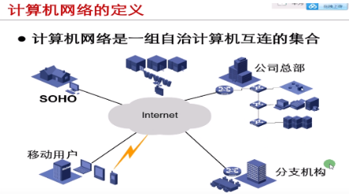

 

网络的组成：

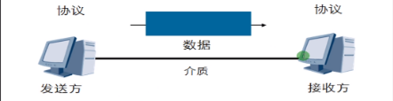

| 术语          | 备注                 |
| ------------- | -------------------- |
| 设备          | Device               |
| 介质          | Media                |
| 消息/报文     | Massage/Data         |
| 协议          | Protocol             |
| 发送方/信息源 | Sender/Source        |
| 接受发/信息目 | Receiver/Destination |

数据通信是双向的（保证数据的来回）
网络的演进：

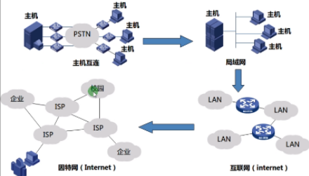

小型主机互联形成了局域网LAN

多个局域网互联就成了internet 互联网

全球相连就形成了Internet 因特网

| 术语     | 备注                       |
| -------- | -------------------------- |
| network  | 网络，一组互连、通信的设备 |
| internet | 互联网，多个互联互通的网络 |
| Internet | 因特网，互联全世界的网络   |

Internet组成：

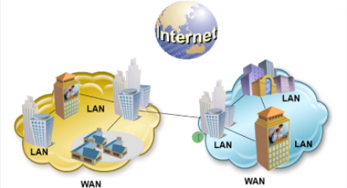

ISP：Internet service providers 因特网服务提供商，向用户提供互联网接入业务、信息业务、和增值业务，俗称运营商，如：电信、移动、联通

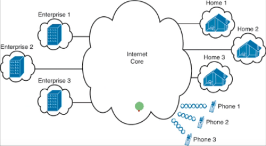

用户通过Internet互联

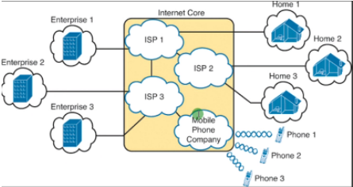

Internet通过ISP构建

| 用途                       | WAN服务                       | ISP              |
| -------------------------- | ----------------------------- | ---------------- |
| 最后一公里接入（宽带接入） | 光纤、LAN、ADSL               | 电信、移动、联通 |
| 移动通信                   | WinMAX、3G/4G/5G、公共无线LAN | 电信、移动、联通 |
| VPN                        | 广域以太网、IP-VPN、以太网VPN | 电信、移动、联通 |
| 专线                       | ATM、专线                     | 电信、移动、联通 |

网络的类型：根据覆盖范围不同，组网技术不同（二层）

| 类型                   | 备注                                    |
| ---------------------- | --------------------------------------- |
| PAN （个人蓝牙、热点） | Personal area network，个人网           |
| LAN（多台主机构建）    | Local area network，局域网              |
| CAN（大的局域网构建）  | Campus area network，园区网             |
| MAN（一个城市构建）    | Metropolitan area network，城域网       |
| WAN（城市与城市构建）  | Wide area network，广域网               |
| WLAN（WiFi）           | Wireless local area network，无线局域网 |
| WWAN（3G/4G）          | Wireless wide area network，无线广域网  |

协议：Protocol
- 网络通信中的“语言”
- 汉语和英文当作“协议”
- 聊天当作“通信”
- 说话的内容当作“数据”
- 决定数据的格式和传输的一组规则
- What ？How ？When ？
- 协议一致，通信轻松

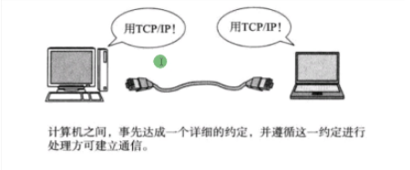

网络性能指标：
- 带宽（bandwidth）
- 描述在单位时间内从一个节点到另一个节点的数据量
- 类似于水管的粗细、公路的宽度
- 以bps（bit per second 比特每秒）为单位
- 如：以太网贷款为10Mbps，快速以太网为100Mbps

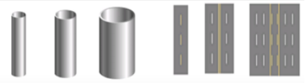

- 延迟（delay）
- 描述在单位时间内从一个节点到另一个节点的时间
- 以ms为单位

网络拓扑：topology ，用来描绘网络结构（网络类型、设备类型、设备数量、线缆、带宽、服务、数据走向等）示意图

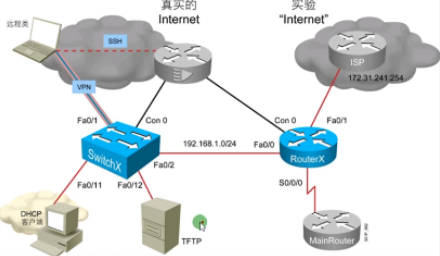

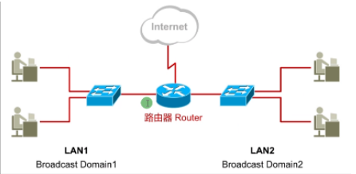

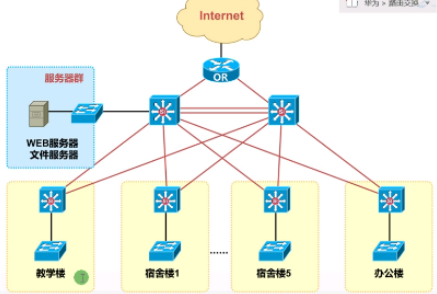

 

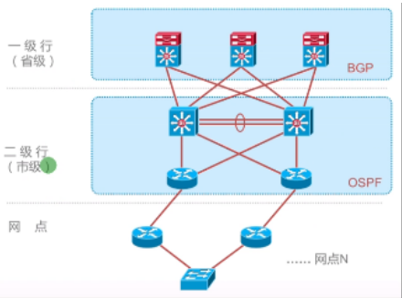

 

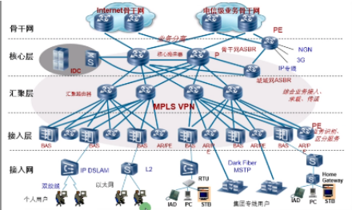

 

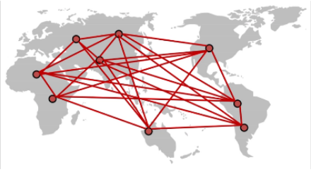

制作拓扑图的软件：PPT，visio，亿图，模拟器

拓扑类型：根据接口、线缆、封装判断

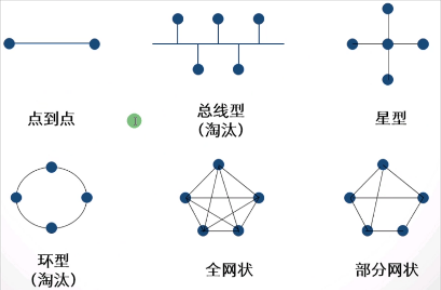

星型 特点：边缘设备故障不影响其他设备通信

缺点：核心设备故障影响所有设备通信

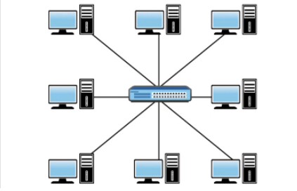
