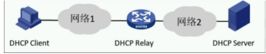
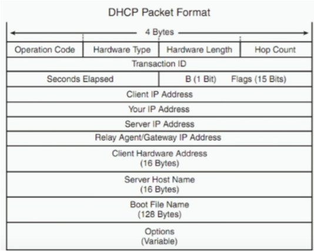
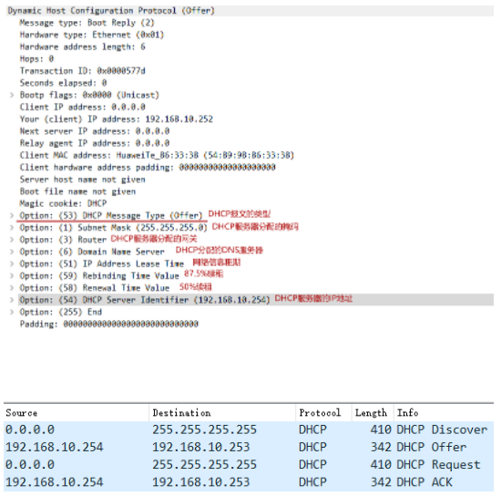
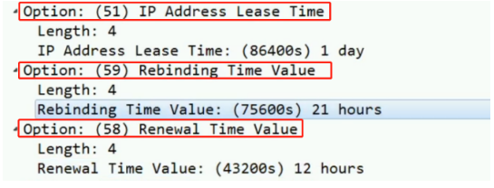
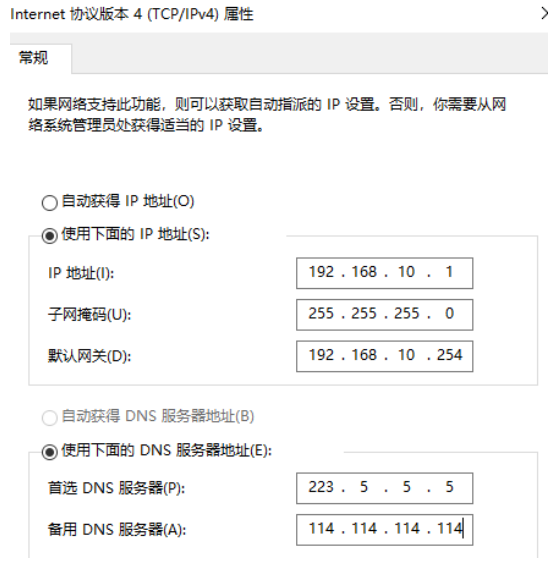
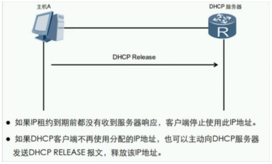

DHCP：Dynamic Host Configure Protocol 动态主机配置协议
- 从BOOTP（Bootstrap Protocol）协议发展而来
- UDP封装，服务器使用端口67，客户端使用端口68
- 动态分配网络信息（IP地址、子网掩码、网关、DNS服务器等）
- 分配给客户端的网络信息是有租约的

 

DHCP系统组成：

| DHCP Cilent客户端 | 请求网络信息的用户             |
| ----------------- | ------------------------------ |
| DHCP Server服务器 | 能够提供DHCP功能的设备         |
| DHCP Relay中继    | 一般为路由器或三层交换机等设备 |

DHCP报文结构：

| 报文类型           | 备注                                                  |
| ------------------ | ----------------------------------------------------- |
| DHCP Discover 发现 | 客户端寻找DHCP服务器                                  |
| DHCP Offer 提供    | 服务器响应DHCP Discover报文，该报文携带了各种配置信息 |
| DHCP Request 请求  | 客户端请求服务器对网络信息确认或者续约租期            |
| DHCP ACK 确认      | 服务器对DHCP Request报文确认响应                      |
| DHCP NAK 不确认    | 服务器对DHCP Request报文的拒接响应                    |
| DHCP Release 释放  | 客户端要释放地址时用来通知服务器                      |

DHCP工作流程：

 注：Office报文和ACK报文也可以是广播包，因为服务器只是根据Mac地址回应，根本没有看三层 （在ACK确认之后才是真正的使用地址）

NAK报文出现：
- 1.IP地址可能已经被使用
- 2.租期未到网络信息还存在，换了DHCP服务器 （回家，请求续约，但是服务器根本不存在该网络信息）

DHCP租期更新：

在租期时间过50%后，主机会自动发送DHCP Request报文请求DHCP服务器重新续租

 DHCP重绑定：

在租期时间过50%一直请求服务器，但服务器未响应，客户端在87.5%会以广播的形式发送DHCP Request报文请求以获取IP地址。 （注：是以广播的形式发送）

无法获取到DHCP服务器分配的网络信息，Windows客户端会自动使用169.254.0.0/16地址，供临时通信

无法获取从DHCP服务器获取网络信息的排错：

1.检测物理链路，驱动…..

2.Windows的DHCP client服务未开启

3.手动配置地址，测试于DHCP服务器的连通性

 租期设置建议：

 释放DHCP服务器分配的网络信息：

DHCP地址池（pool）：所分配地址的集合

- 地址池的分类：接口地址池和全局地址池
- 同时配置，接口地址池优先级比全局地址池高

DHCP配置：

| 命令                                                         | 备注                                          |
| ------------------------------------------------------------ | --------------------------------------------- |
| dhcp enable                                                  | 开启DHCP功能                                  |
| interface G0/0/0                                             | 进入具体接口开始配置                          |
| dhcp selcet interface                                        | 创建DHCP接口模式地址池                        |
| dhcp server dns-list 114.114.114.114 223.5.5.5               | 配置接口地址池的DNS服务器地址（可以配置多个） |
| dhcp server lease day 1 hour 12                              | 配置接口地址池的租期，默认1天                 |
| dhcp server excluded-ip-address 192.168.10.100               | 配置接口地址池排除的地址                      |
| dhcp server static-bind-ip-address 192.168.10.100 mac-address xxxx.xxxx.xxxx | 配置静态绑定                                  |
| dhcp select globa                                            | 创建DHCP全局模式地址池                        |
| ip pool RoomA                                                | 创建全局地址池名称                            |
| network 192.168.10.0 mask 24                                 | 配置全局地址池可分配的网段地址                |
| gateway-list 192.168.10.1                                    | 配置全局地址池的网关地址                      |
| dns-list 114.114.114.114 223.5.5.5                           | 配置全局地址池的网关地址                      |
| lease day 1 hour 12                                          | 配置全局地址池下的租期，默认1天               |
| excluded-ip-addess 192.168.10.111                            | 配置全局地址池下的排除地址范围                |
| dhcp select relay                                            | 关联接口开启中继代理                          |
| dhcp relay server-ip192.168.10.254                           | 指定DHCP服务器的地址                          |
| display ip pool interface vlanif10 used                      | 验证某接口地址池的信息                        |
| display ip pool name huawei used                             | 验证全局地址池的信息                          |
| display ip pool [interface 接口名 all]                       | 查看地址池的属性                              |
| ipconfig /release                                            | 释放租期                                      |
| ipconfig /renew                                              | 重新获取                                      |

DHCP接口地址池配置：

DHCP全局地址池配置：

