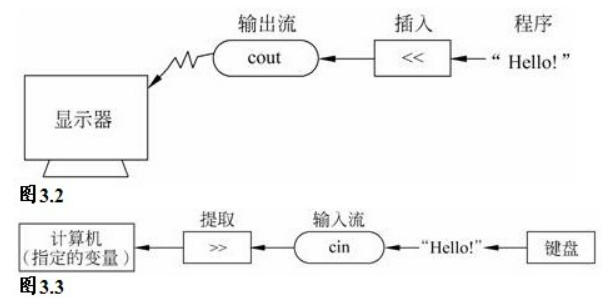

## 什么是cout

**cout是一个对象**
它的作用是把通过`<<`输入它的消息显示在屏幕上（具体怎么实现可以暂时不用了解。这就是对象的好处之一，你可以不需要理解它的内部工作原理，只要知道怎么用就行），
`cout<<"aa"`这句语句的含义就是把字符串"aa"插入到输出流中去，插入之后对象`cout`会自动想办法把插入的流显示到屏幕上。

**什么是<<**

1. <<和左移运算符一样
2. 你可能会疑问为什么左移运算符可以表示插入
3. 这里是使用了运算符重载，<<被重载成了插入运算符
4. 具体什么是重载运算符这里不需要理解
5. <<在这里的作用就是把右边的信息以流的方式插入左边的cout中

**什么是endl;**
endl是一个特殊的C++符号
endl表示重启一行
endl也被定义在iostream中,位于命名空间std中

**endl和’\\n’的关系**
两者都可以表示换行
endl确保程序继续运行前刷新输出，'\\n'不能提供这样的保证，意味着在有些系统中,有时可能在你输入信息后才显示