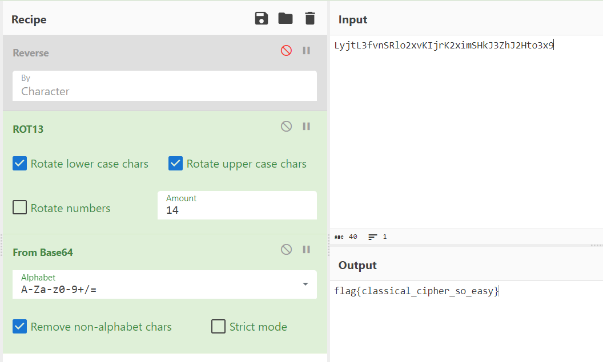
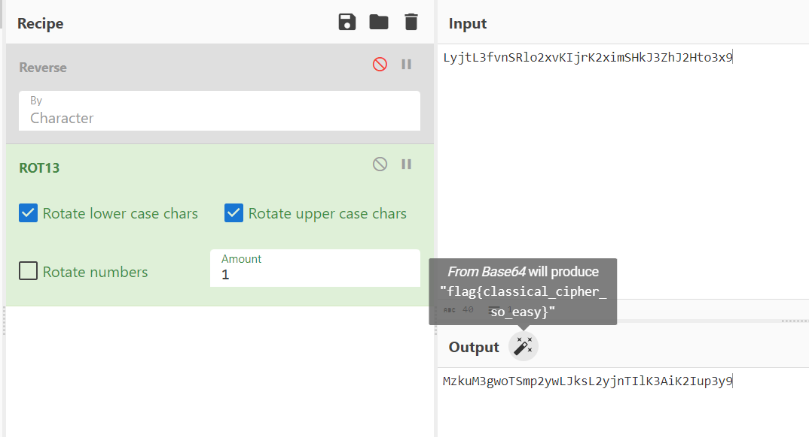
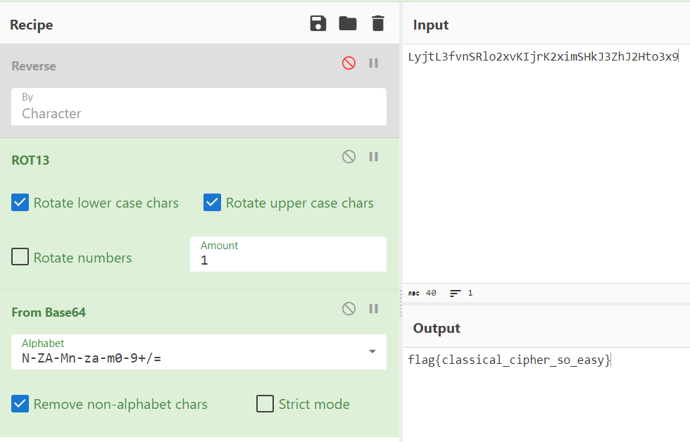

## 题目描述
classical

## 解题
下载附件，得到密文：
```txt
Ld hcrakewcfaxr, f hofjjlhfo hlaxuc lj f krau ev hlaxuc kxfk zfj tjui xljkeclhfoor gtk dez xfj vfooud, vec kxu pejk afck, ldke iljtju. Ld hedkcfjk ke peiucd hcrakewcfaxlh foweclkxpj, pejk hofjjlhfo hlaxucj hfd gu acfhklhfoor hepatkui fdi jeoyui gr xfdi. Xezuyuc, OrmkO3vydJCoe2qyNLmcN2qlpJXnM3SxM2Xke3q9 kxur fcu foje tjtfoor yucr jlpaou ke gcufn zlkx peiucd kuhxdeoewr. Kxu kucp ldhotiuj kxu jlpaou jrjkupj tjui jldhu Wcuun fdi Cepfd klpuj, kxu uofgecfku Cudfljjfdhu hlaxucj, Zecoi Zfc LL hcrakewcfaxr jthx fj kxu Udlwpf pfhxldu fdi guredi. F btlhn gcezd veq mtpa eyuc kxu ofsr iew.
```
看起来没什么规律，查看题目叫经典，猜测与古典密码有关，经过常见古典密码对比，有可能是字母频率分析：
[字母频率分析](https://www.quipqiup.com/)

得到明文：
```txt
In cryptography, a classical cipher is a type of cipher that was used historically but now has fallen, for the most part, into disuse. In contrast to modern cryptographic algorithms, most classical ciphers can be practically computed and solved by hand. However, LyjtL3fvnSRlo2xvKIjrK2ximSHkJ3ZhJ2Hto3x9 they are also usually very simple to break with modern technology. The term includes the simple systems used since Greek and Roman times, the elaborate Renaissance ciphers, World War II cryptography such as the Enigma machine and beyond. A quick brown fox jump over the lazy dog.

翻译：
在密码学中，经典密码是历史上使用过的一种密码，但现在大部分已经废弃了。与现代密码算法相比，大多数经典密码可以实际计算和手工求解。然而，LyjtL3fvnSRlo2xvKIjrK2ximSHkJ3ZhJ2Hto3x9它们通常也很容易与现代技术相突破。这个术语包括自希腊和罗马时代以来使用的简单系统，文艺复兴时期精心设计的密码，第二次世界大战期间的密码学，如Enigma机器等。一只敏捷的棕色狐狸跳过了那只懒狗。
```
猜测flag就在文本中的字符串`LyjtL3fvnSRlo2xvKIjrK2ximSHkJ3ZhJ2Hto3x9`中，
根据经验，题目无其他信息，先进行移位，

未发现变化，然后再加上`base64`：
发现在`移位=14`时可以用`base64`解出`flag`：


或者使用`CyberChef`的魔法棒功能也能解出：


点击得到flag


`flag{classical_cipher_so_easy}`