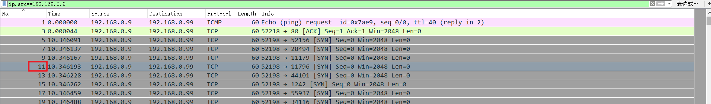
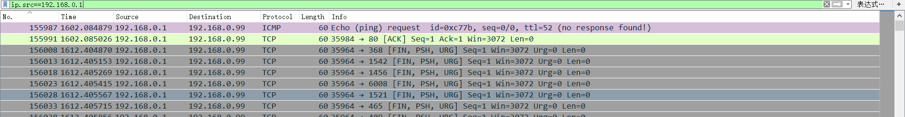
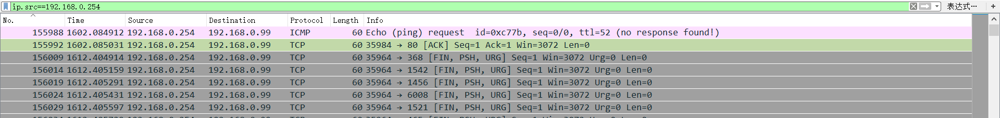
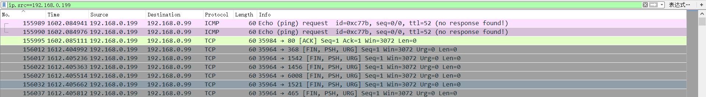

## 题目描述
有人在内网发起了大量扫描，而且扫描次数不止一次，请你从 capture日志分析一下对方第4次发起扫描是什么时候开始的， 请提交你发现包编号的sha256值(小写)。

## 解题
下载附件，
题目给的是一个日志文件，但根据题目分析猜测是流量包，改后缀为`pcapng`，打开：

观察流量包，可以看到有四个IP（`192.168.0.9`、`192.168.0.1`、`192.168.0.254`、`192.168.0.199`）分别对`192.168.0.99`进行了SYN扫描，并且大部分是`192.168.0.9`在扫描。
分析题目，是：
- 第一个ip对目标发起的第四次扫描
- 还是第四个ip对目标发起的第一次扫描

分别对四个IP进行筛选：
`192.168.0.9`

`192.168.0.1`

`192.168.0.254`

`192.168.0.199`

可以看到只有`192.168.0.9`对目标发起了四次以上的扫描，
并且每个ip扫描前都对目标进行了ping操作
将第四次扫描的包编号11进行尝试发现不对

所以改变思路将每个ip进行的第一次进行扫描的包编号进行尝试：
最终在`192.168.0.199`的第一次扫描编号`155989`尝试成功。

得到flag：`PCTF{0be2407512cc2a40bfb570464757fd56cd0a1d33f0bf3824dfed4f0119133c12}`