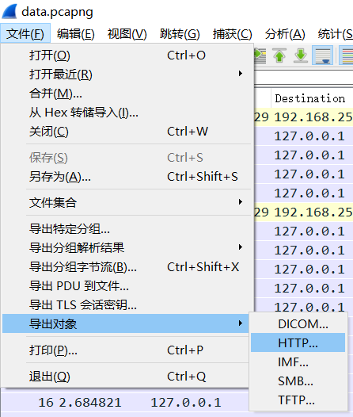
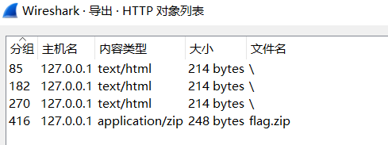
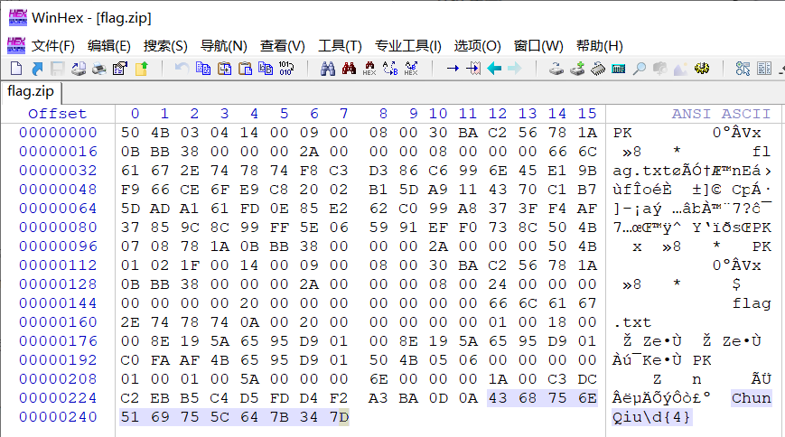
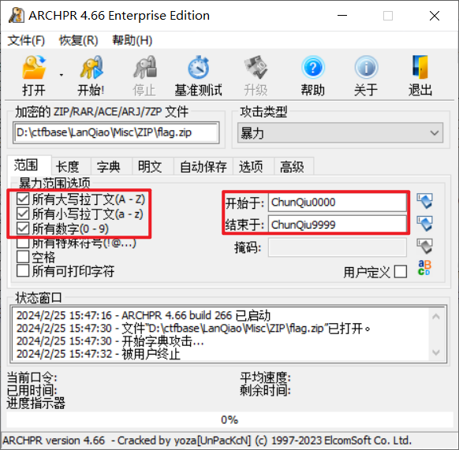
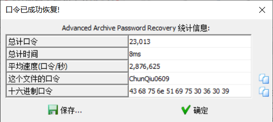

## 题目描述

小蓝同学有一个加密的压缩包，里面藏着一些秘密，他把它上传到了一个网站上。但是之后不小心把本地的文件删除了，他想重新下载它，可却再也访问不了那网站。万幸的是，他用`wireshark`记录了他之前下载压缩包的网络流量，并把它保存下来了。你能帮他从流量中恢复出压缩包吗？

## 解题

下载附件，用`wireshark`打开，因为题目说流量中有压缩包，我们直接导出HTTP对象：

可以看到有一个`flag.zip`压缩包保存下来

解压发现需要密码，返回`wireshark`查看并未发现有效信息；

用`winhex`打开压缩包发现在zip文件格式之外有信息，猜测是密码提示：

可以看到密码可能是以`ChunQiu`开始的11位字符密码，其中的`\d`猜测后面的4位字符为数字；

于是使用`ARCHPR`暴力破解：[ARCHPR绿色版](../Tools/ARCHPR_4.66.266.0_汉化绿色版.zip "文件在上级目录")

设置密码范围和密码类型，开始爆破

得到压缩包密码：`ChunQiu0609`

打开压缩包中的`flag`文件

得到`flag{48a4b6f1-7812-417b-9e1f-e17450ef0c43}`