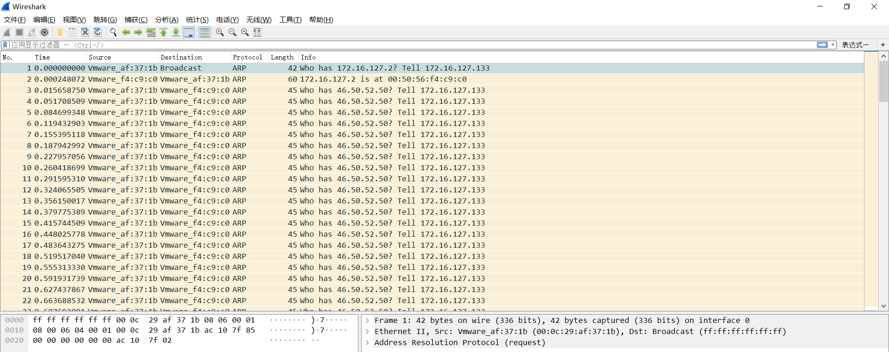
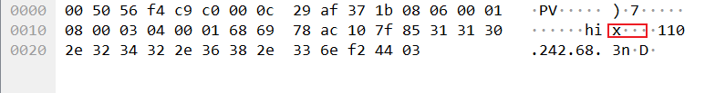
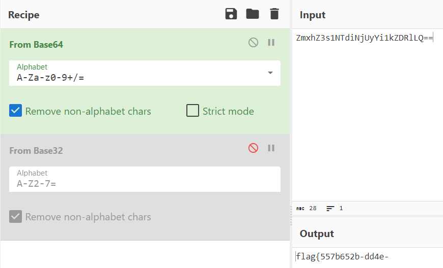
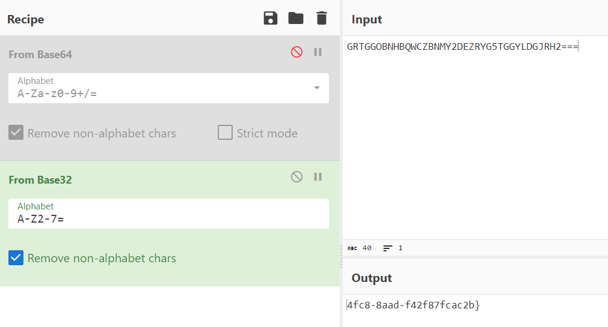

## 题目描述

小蓝在应急响应中成功抓取到了一些 ARP 流量，并发现其中暴露了攻击者的关键信息。通过分析攻击者的MAC地址、IP地址、设备标识符或其他可追溯到攻击者身份的数据，小蓝可以获得有关攻击者的更多洞察，并采取适当的措施应对安全威胁。请帮助小蓝分析出攻击者留下来的踪迹。

## 解题

下载附件，用`wireshark`打开

全是ARP报文，无其他信息

随意点击每个报文，可以看出每个报文中只有一个字节发生变化，记录下来：

1. `ZmxhZ3s1NTdiNjUyYi1kZDRlLQ==`
2. `GRTGGOBNHBQWCZBNMY2DEZRYG5TGGYLDGJRH2===`

可以看到一个是`base64`编码，一个是`base32`编码；

分别进行解码：

1. `flag{557b652b-dd4e-`
2. `4fc8-8aad-f42f87fcac2b}`

拼接得到`flag{557b652b-dd4e-4fc8-8aad-f42f87fcac2b}`

